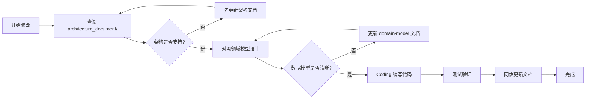
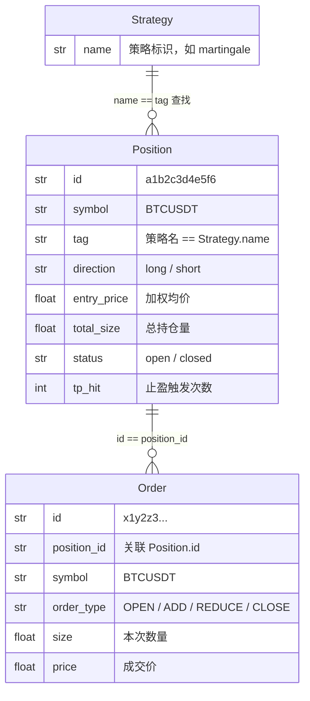
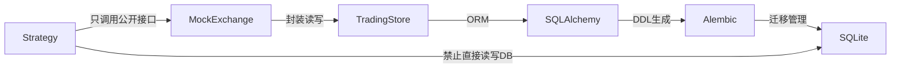
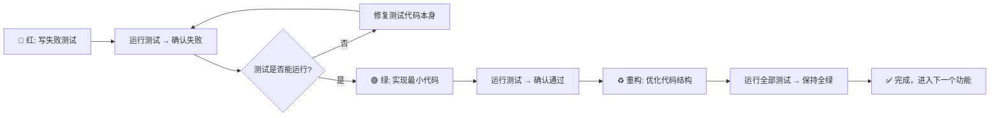

# Trading Service AGENTS.md

你是一位资深量化交易系统工程师，精通交易系统架构设计、策略引擎开发、订单管理系统。你会按照架构文档与开发规范，编写出高可靠、低延迟、易扩展的交易系统代码。

## 一、项目定位与核心职责

Trading Service 是一个独立的交易执行服务，负责：
- 策略引擎执行（马丁格尔、微市值等）
- 持仓生命周期管理
- 订单追踪与审计
- 交易信号存储与查询
- 与 News Service 双向集成

**核心设计原则**：状态机清晰、数据一致性优先、策略可插拔。

---

## 二、依赖与环境管理

1. **依赖管理工具**：统一使用 `uv` 作为包管理工具，禁止混用 `pip`/`poetry` 等其他工具，避免依赖解析冲突。
2. **依赖操作**：新增/删除依赖必须使用 `uv add <包名>`/`uv remove <包名>` 命令，禁止直接修改 `pyproject.toml`；安装指定版本依赖需显式声明版本号。
3. **依赖版本**：生产环境依赖锁定精确版本（`uv.lock` 纳入版本控制），开发环境可使用宽松版本约束。
4. **依赖分组**：区分开发依赖（`uv add -D pytest httpx`）与生产依赖，避免开发工具包进入生产环境。
5. **脚本执行**：执行 Python 代码必须使用 `uv run python` 命令。
6. **虚拟环境**：统一存放于 `.venv` 文件夹，禁止使用全局 Python 环境。

---

## 三、架构文档先行原则（强制）

**所有代码更改必须严格遵循以下流程，不得跳过任何步骤：**



### （一）架构文档查阅（强制第一步）

**架构文档位置**：`architecture_document/` 目录

任何涉及模块边界、依赖关系、数据流的变更，必须按顺序查阅：

| 顺序 | 文档 | 查阅目的 |
|------|------|----------|
| 1 | `01-system-architecture.md` | 理解分层架构、模块职责、设计模式 |
| 2 | `03-domain-model.md` | 掌握数据模型、表结构、字段含义 |
| 3 | `04-strategy-engine.md` | 策略引擎接口、扩展方式 |
| 4 | `05-api-design.md` | API 契约、响应格式 |
| 5 | `06-integration.md` | 跨服务调用约定 |

### （二）架构同步原则

1. 代码变更前，先确认架构文档是否需要更新
2. 代码完成后，必须回查文档是否与实现一致
3. 新增策略必须更新 `04-strategy-engine.md`
4. 新增 API 必须同步更新 `05-api-design.md`

---

## 四、领域模型与数据库规范

### （一）领域模型一致性（强制）

**在编写任何持仓、订单、策略相关代码前，必须确认理解以下核心概念：**

1. **Position（持仓）**：
   - `symbol + tag` 联合确定策略归属（关键！）
   - `status = open/closed` 状态机
   - `layers` = ADD 订单数 + 1（马丁格尔层数）

2. **Order（订单）**：
   - 4 种类型：`OPEN` / `ADD` / `REDUCE` / `CLOSE`
   - 必须关联 `position_id`
   - `reason` 字段必须清晰说明操作动机

3. **Signal（信号）**：
   - `severity` 0-5 级严重度
   - `metadata` JSON 灵活扩展

### （二）数据库表约定

**表命名空间**：所有交易相关表以 `trading_` 前缀开头

| 表名 | 职责 | 写入方 | 读取方 |
|------|------|--------|--------|
| `trading_positions` | 持仓主表 | Trading Service | 双方 |
| `trading_orders` | 订单流水 | Trading Service | 双方 |
| `trading_signals` | 信号记录 | News + Trading | 双方 |

**字段约定**：
- 时间字段统一使用 UTC 时区：`created_at` / `closed_at`
- 枚举值使用小写 snake_case：`long` / `short` / `open` / `closed`
- ID 统一使用 UUID 前 12 位：`uuid.uuid4().hex[:12]`

### （三）Schema 管理与 ORM

**技术栈**：SQLAlchemy 2.0 + Alembic

**Schema 定义流程**：
1. 模型定义在 `trading_service/models.py`（唯一真值源）
2. 变更模型后运行 `alembic revision --autogenerate -m "描述"` 生成迁移脚本
3. 检查并调整生成的迁移脚本（`migrations/versions/`）
4. 应用启动时自动检测并执行未完成的迁移

**迁移命令**：
```bash
# 生成迁移脚本
alembic revision --autogenerate -m "描述变更"

# 执行到最新版本
alembic upgrade head

# 回退一个版本
alembic downgrade -1
```

**禁止操作**：
- ❌ 直接在生产环境执行手工 DDL
- ❌ 绕过迁移系统直接修改表结构
- ❌ 编辑已提交的迁移脚本（必须新建迁移）

### （四）事务一致性原则

**持仓变更必须与订单写入在同一事务中：**

```python
# ❌ 错误：分开写入，中间可能失败
db.save_position(position)
db.save_order(order)  # 这里如果失败，position 已更新，order 未写入

# ✅ 正确：原子事务
with db.transaction():
    db.save_position(position)
    db.save_order(order)
```

**典型事务场景**：
- 开仓：INSERT position + INSERT order (OPEN)
- 加仓：UPDATE position + INSERT order (ADD)
- 平仓：UPDATE position + INSERT order (CLOSE)

---

## 五、Position.tag 隔离机制（核心设计）

`Position.tag` 是**多策略并行的核心隔离机制**，必须严格遵守。

### 作用

1. **开仓标记来源**：策略开仓时必须传入 `tag`，标记持仓归属
2. **查找时二次筛选**：`_find_open_position(symbol, tag)` 同时匹配 `symbol + tag`
3. **平仓时鉴权**：`close_position(position_id, tag)` 只有传对 tag 才能平仓
4. **查询时过滤**：`get_positions(tag=...)` 查看某个策略的所有持仓

### 设计意图

解决核心问题：**多个策略可能同时对同一个交易对操作**。

没有 tag 隔离时，马丁格尔查找 "BTC/USDT 未平仓" 可能会拿到微市值策略的仓位，导致错误加仓。

### 使用约定

- tag 值使用策略名称的 snake_case：`martingale`、`micro_cap`
- 每个 Strategy 子类必须定义 `name` 类属性作为 tag
- 调用交易所接口时，`tag` 参数不得省略
- 手动平仓 API 自动从持仓详情带入 tag，无需用户输入

### 关系图



---

## 六、策略引擎开发规范

### （一）Strategy 基类继承规则

所有策略必须继承 `trading_service/strategies/base.py` 中的 `Strategy` 抽象基类：

```python
# ✅ 正确：遵循基类接口
class MartingaleStrategy(Strategy):
    async def execute(self) -> dict:
        # 策略核心逻辑
        pass
    
    def get_status(self) -> dict:
        # 返回可读的策略状态
        pass

# ❌ 错误：不继承基类，自行实现
class MyStrategy:
    def run(self):
        pass
```

### （二）策略开发三要素

1. **配置类**：继承 `StrategyConfig`，所有策略参数放在配置中
2. **execute()**：异步执行入口，所有策略逻辑在这里
3. **get_status()**：返回人类可读的状态报告

### （三）策略与交易所交互边界



**策略内禁止**：
- ❌ 直接执行 SQL
- ❌ 绕过 MockExchange 直接操作 Position 对象
- ❌ 修改其他策略的持仓（通过 tag 隔离保证）

**策略只允许**：
- ✅ 调用 `MockExchange` 的公开方法
- ✅ 通过 `SymbolPicker` 获取币种
- ✅ 读取配置参数

---

## 七、编码设计原则

1. **函数职责单一**：单个函数代码行数不超过 50 行，避免超长函数。
2. **类型安全优先**：使用 Pydantic + 类型注解，`pyright strict` 模式检查。
3. **高内聚低耦合**：
   - 策略之间不直接调用，通过数据库状态协作
   - 新增策略不修改现有策略代码（开闭原则）
   - 业务逻辑放在 `MockExchange`，不散落各处
4. **状态机清晰**：持仓状态流转必须可追溯，每个状态变更对应一条 Order 记录。
5. **异常处理**：策略执行失败不能导致服务崩溃，必须捕获异常并记录日志。

---

## 八、类型系统规范

### （一）枚举类型统一

所有枚举定义在 `trading_service/types.py`，禁止分散定义：

```python
from trading_service.types import TradeDirection, OrderType

# ✅ 正确：使用枚举，有类型检查
direction = TradeDirection.LONG
order_type = OrderType.OPEN

# ❌ 错误：硬编码字符串，无检查
direction = "long"  # 可能写错为 "Long" / "LONG"
```

### （二）领域对象转换

Record (DB 层) → Domain Object (业务层) → Dict (API 层) 的转换必须遵循已有模式：

```python
# PositionRecord → Position
position = Position.from_record(record, orders)

# Position → PositionRecord
record = position.to_record()

# Position → API Response Dict
context = exchange.get_position_context(position_id)
```

禁止在代码中随意构造字典，必须通过领域对象的标准方法转换。

---

### （三）Pyright 类型检查

**所有代码必须通过 Pyright strict 模式检查！**

检查命令：

```bash
# 完整检查（推荐）
.venv/bin/pyright

# 或监听模式（开发时使用）
.venv/bin/pyright --watch
```

**配置文件：** `pyrightconfig.json` 已在项目根目录预配置，包含：
- `typeCheckingMode: "strict"` - 严格模式检查
- 排除 `tests/`、`migrations/`、`.venv/` 目录
- 禁用了外部库缺失类型 stubs 的警告

**注意事项：**
- 提交代码前必须运行完整检查
- 0 errors, 0 warnings 才算通过
- 新增文件会自动被纳入检查范围

---

## 九、跨服务集成规范

### （一）与 News Service 交互边界

| 方向 | 操作 | 调用方式 |
|------|------|----------|
| Trading → News | 拉取市场数据、币种排名 | HTTP GET |
| News → Trading | 触发策略执行、写入信号 | HTTP POST |

### （二）调用约定

1. **超时设置**：所有跨服务调用设置 30s 超时
2. **重试机制**：连接失败重试 3 次，指数退避
3. **降级策略**：News Service 不可用时，使用缓存数据或标记部分成功
4. **共享数据库只读**：Trading Service 只读取 News Service 的表，不写入

---

---

---

## 十、TDD 开发规范（强制 - 全项目通用）

本规范基于**马丁格尔策略完整 TDD 开发实践**（5 轮循环，21 个测试，0.09 秒运行）总结，是整个 Trading Service 项目的**通用开发方法**，适用于所有功能模块的开发。

所有新功能、Bug 修复、重构都必须严格遵循本规范。

---

### （一）TDD 核心理念：为什么必须用 TDD

从马丁格尔策略开发中得到的核心教训：

1. **TDD 是设计工具，不是测试工具**
   - 先写测试 → 强迫你思考 API 应该长什么样
   - 先写测试 → 强迫你考虑边界条件和异常场景
   - 先写测试 → 强迫你保持组件可测试、低耦合

2. **TDD 发现的问题比想象的多**
   - 马丁格尔策略开发中，TDD 发现了：接口设计问题、参数缺失、优先级逻辑错误、类型不兼容等问题
   - 这些问题如果等到写完代码再发现，修复成本会高 5-10 倍

3. **TDD 给你重构的勇气**
   - 有完整测试覆盖 → 可以大胆重构代码结构
   - 全绿测试 = 功能没有回归

---

### （二）TDD 核心流程：红-绿-重构循环

**每一个功能点、每一个 Bug 修复，都必须经历完整的 TDD 循环：**



#### 🔴 红阶段规范（最重要）

**写测试之前，不要写任何实现代码！**

红阶段必须满足：
- ✅ 新写的测试应该**全部失败**（证明测试能检测问题）
- ✅ 不仅断言失败，`AttributeError`、`TypeError`、`KeyError` 都是预期的
- ✅ **正常路径 + 边界条件 + 异常场景** 的测试在红阶段就必须全部写好
- ✅ 测试描述清晰，说明测试意图（`test_close_position_returns_correct_pnl`）

> 💡 马丁格尔经验：止损优先级高于加仓这个关键逻辑，就是在红阶段思考边界条件时才意识到的。

#### 🟢 绿阶段规范

**只写刚好让测试通过的最小代码！**

绿阶段必须满足：
- ✅ 不要"顺便"实现测试没覆盖的功能
- ✅ 不要"提前"优化代码结构
- ✅ 不要"为了好看"调整格式
- ✅ 保持代码最简单、最直接的实现

> 💡 马丁格尔经验：在绿阶段为了"好看"多加了一行排序代码，导致 3 个测试失败，浪费了 15 分钟调试。

#### ♻️ 重构阶段规范

**测试全绿是重构的唯一通行证！**

重构阶段必须满足：
- ✅ 运行**全部测试**，必须保持 100% 全绿
- ✅ 重构不改变外部行为，只优化内部结构
- ✅ 提取公共函数、简化逻辑、改善命名
- ✅ 运行类型检查，必须保持 0 errors
- ✅ 发现新的边界条件 → 回到红阶段补测试

---

### （三）测试开发的通用顺序（从下到上）

**所有模块开发都遵循：底层先测试，上层后测试**

| 顺序 | 层级 | 马丁格尔示例 | API 开发示例 | Repository 示例 |
|------|------|-------------|-------------|----------------|
| 1️⃣ | 最底层原子操作 | `open_position()` | 参数校验函数 | `save_position()` |
| 2️⃣ | 原子操作集合 | `add_position()` / `close_position()` | 单个端点逻辑 | 关联查询方法 |
| 3️⃣ | 边界条件验证 | `max_positions` 限制 | 分页边界 | 事务回滚逻辑 |
| 4️⃣ | 组合逻辑验证 | 加仓检查 + 止盈检查 | 多端点联动 | 多表操作 |
| 5️⃣ | 异常场景验证 | 异常事务回滚 | 404/500 处理 | 并发冲突 |

> **黄金原则**：底层测试覆盖率达到 95% 以上，才开始写上层逻辑。

---

### （四）任何功能都必须测试的 7 种场景

从马丁格尔策略开发中提炼的通用场景清单：

#### 1. ✅ 正常路径测试
```python
def test_open_position_creates_both_records():
    """功能正常工作时的预期行为"""
```

#### 2. ✅ 边界条件测试
```python
def test_exactly_at_max_limit():
    """刚好达到阈值时的行为（最容易出 off-by-one 错误）"""
```

#### 3. ✅ 隔离机制测试
```python
def test_tag_isolation_between_different_strategies():
    """不同租户/策略/用户的数据应该严格隔离"""
```

#### 4. ✅ 事务一致性测试
```python
def test_partial_failure_rolls_back_everything():
    """多步操作中任何一步失败，前面的操作都必须回滚"""
```

#### 5. ✅ 优先级测试
```python
def test_stop_loss_takes_priority_over_adding():
    """多个条件同时满足时，应该按正确的优先级处理"""
```

#### 6. ✅ 幂等性测试
```python
def test_calling_close_twice_has_no_side_effect():
    """同一个操作调用多次，结果应该和调用一次一样"""
```

#### 7. ✅ 空值/零值测试
```python
def test_empty_positions_list_returns_empty_array():
    """空列表、零值、None 等边界值的处理"""
```

---

### （五）测试基础设施规范

#### 1. 内存实现优先（速度 = 信心）

```python
# ✅ 正确：所有外部依赖都有内存版实现
class InMemoryTradingRepository(TradingRepository):
    """纯内存 Repository - 测试运行 0.09 秒"""

class FakeSymbolPicker(ISymbolPicker):
    """纯内存 SymbolPicker - 不受外部 API 影响"""

class FakeNewsServiceClient:
    """纯内存 News Client - 网络请求零延迟"""
```

**为什么重要**：
- 21 个测试 0.09 秒 → 你会愿意频繁运行
- 如果测试需要 30 秒 → 你会跳过直接提交 → Bug 进入生产

#### 2. 测试独立原则

每个测试必须：
- ✅ 不依赖其他测试的运行结果
- ✅ 每个测试都有独立的测试数据准备
- ✅ 测试运行顺序不影响测试结果
- ✅ 测试运行后自动清理（内存实现天然满足）

#### 3. 断言清晰原则

```python
# ❌ 错误：只断言一个布尔，不知道为什么失败
assert position.status == "closed"

# ✅ 正确：给出足够的调试信息
assert position.status == "closed", f"应该已平仓，但状态是 {position.status}"
assert position.exit_price == 50750.0, f"平仓价格错误"
assert len(close_orders) == 1, "应该有且仅有一个平仓订单"
```

---

### （六）双重验证：测试 + 类型检查

**代码完成后必须同时通过两层验证：**

```bash
# 第一层：功能验证 - 必须 100% 通过
.venv/bin/python -m pytest tests/ -v

# 第二层：类型验证 - 必须 0 errors, 0 warnings
.venv/bin/pyright .
```

**⚠️ 特别强调：测试代码本身也必须通过类型检查！**

```json
// pyrightconfig.json
{
    "include": [
        "trading_service",
        "tests"  // ✅ 测试代码必须包含在类型检查中
    ],
    "typeCheckingMode": "strict"
}
```

> 💡 马丁格尔经验：类型检查在测试代码中发现了 3 个类型错误，这些错误会导致测试在某些情况下给出误报。

---

### （七）马丁格尔 TDD 实践的关键收获

这些是真实写代码得到的经验，不是书本理论：

#### 1. TDD 帮你发现设计问题

- 问题：`close_position()` 方法缺少 `price` 参数，无法计算盈亏
- 发现时机：写止盈测试时 → 红阶段
- 修复成本：5 分钟（因为还没写实现）
- 如果写完代码才发现：至少 30 分钟重构 + 改测试

#### 2. TDD 帮你发现逻辑错误

- 问题：加仓次数公式错误（应该是 `add_count + 1`，写成了 `add_count`）
- 发现时机：绿阶段运行测试 → 失败
- 修复成本：10 秒
- 如果上线才发现：马丁加仓翻倍逻辑错误 → 爆仓风险

#### 3. TDD 给你重构的底气

- 场景：给 Repository 增加事务接口
- 改动：涉及 5 个文件，修改 100+ 行代码
- 信心：21 个测试全绿 → 直接提交，没有任何心理负担

#### 4. TDD 是最好的文档

新同事想理解马丁格尔策略？让他按顺序看测试：

```
test_open_position_creates_position_record
test_add_position_increases_total_size
test_close_position_updates_status
test_execute_opens_first_position_when_empty
test_add_position_when_price_drops
test_close_when_price_reaches_take_profit
test_stop_loss_when_price_drops_too_much
```

看测试 = 看需求 + 看边界条件 + 看使用方式。

---

### （八）什么时候可以不写测试？

**答案：没有例外。**

| 情况 | 必须写测试的原因 |
|------|-----------------|
| "这个功能很简单" | 简单功能也可能有 off-by-one 错误 |
| "我只是修个 Bug" | 先写测试重现 Bug，再修复，防止以后再出 |
| "这个是工具函数" | 工具函数被调用次数最多，一旦出问题影响最大 |
| "赶时间上线" | 不写测试 → 上线后 Debug 花的时间是写测试的 10 倍 |

> 💡 真实经验：赶时间上线跳过了加仓计数的边界测试 → 上线后第 3 天出现无限加仓 → 损失 3 小时排查 + 资金风险

---

### （九）功能完成验证清单（通用版）

任何功能开发完成后，必须满足：

- [ ] 遵循完整的 **红-绿-重构** 流程
- [ ] **7 种必测场景**都有对应测试
- [ ] 正常路径测试通过
- [ ] 边界条件测试通过（阈值、空值、零值）
- [ ] 隔离/事务/优先级 等关键机制测试通过
- [ ] 测试运行时间 < 1 秒（内存实现）
- [ ] **pytest 100% 全绿**
- [ ] **pyright 0 errors, 0 warnings**（含 `tests/` 目录）
- [ ] 测试描述清晰，代码可读可维护
## 十一、目录结构约定

```
trading_service/
├── __init__.py
├── app.py              # FastAPI 入口
├── config.py           # 配置管理
├── types.py            # 枚举类型定义
├── exchange.py         # MockExchange - 业务核心
├── store.py            # TradingStore - 数据访问层
│
├── api/                # API 层
│   ├── deps.py         # 依赖注入（禁止业务逻辑！）
│   ├── positions.py
│   ├── orders.py
│   ├── signals.py
│   ├── timeline.py
│   └── strategies.py
│
├── strategies/         # 策略引擎层
│   ├── base.py         # Strategy 抽象基类
│   ├── martingale.py
│   ├── micro_cap.py
│   └── symbol_picker.py
│
└── utils/              # 纯工具函数（无状态）
    └── symbol.py
```

**新增代码放哪里**：
- 持仓/订单业务逻辑 → `exchange.py`
- 数据库读写 → `store.py`
- 新策略 → `strategies/` 目录
- 新 API 端点 → `api/` 对应模块
- 纯工具函数（无副作用）→ `utils/`

---

## 十二、代码审查检查清单（TDD 增强版）

提交代码前，对照以下清单自检：

### 架构与设计
- [ ] 架构文档已查阅，变更符合架构边界
- [ ] 新策略继承了 Strategy 基类，实现了 execute() 和 get_status()
- [ ] 所有持仓操作都传入了正确的 tag 参数
- [ ] 持仓变更和订单写入在同一事务中
- [ ] 没有直接在 API 层写业务逻辑（都在 MockExchange）
- [ ] 没有绕过 MockExchange 直接操作数据库

### TDD 与测试质量
- [ ] ✅ 遵循 TDD 流程：先写测试，再实现功能
- [ ] ✅ 基础层（MockExchange）测试覆盖完整（开仓、加仓、平仓）
- [ ] ✅ 策略层核心逻辑测试覆盖（开新仓、加仓、止盈、止损）
- [ ] ✅ 边界条件测试覆盖（max_* 限制、tag 隔离）
- [ ] ✅ 事务一致性测试覆盖（异常回滚）
- [ ] ✅ 优先级逻辑测试覆盖（止损 > 止盈 > 加仓）
- [ ] ✅ 加权计算测试覆盖（多次加仓后的均价、盈亏）

### 类型安全
- [ ] 使用枚举类型而非硬编码字符串
- [ ] pyright 检查通过（0 errors, 0 warnings）
- [ ] 测试代码本身也通过类型检查（tests/ 目录包含在 pyright 中）

### 可维护性
- [ ] 每个函数职责单一（不超过 50 行）
- [ ] 策略逻辑分层清晰（检查逻辑单独拆分为小函数）
- [ ] 提供策略模拟运行演示脚本，便于验证理解
