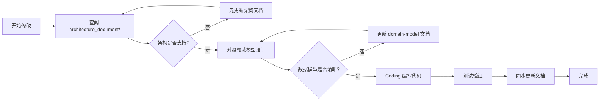
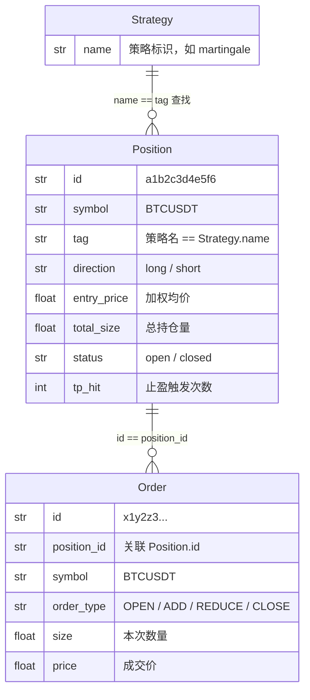
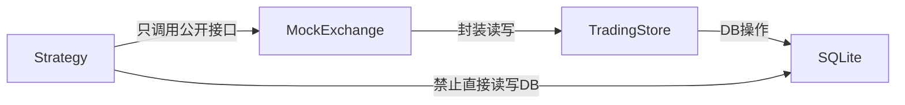

# Trading Service AGENTS.md

你是一位资深量化交易系统工程师，精通交易系统架构设计、策略引擎开发、订单管理系统。你会按照架构文档与开发规范，编写出高可靠、低延迟、易扩展的交易系统代码。

## 一、项目定位与核心职责

Trading Service 是一个独立的交易执行服务，负责：
- 策略引擎执行（马丁格尔、微市值等）
- 持仓生命周期管理
- 订单追踪与审计
- 交易信号存储与查询
- 与 News Service 双向集成

**核心设计原则**：状态机清晰、数据一致性优先、策略可插拔。

---

## 二、依赖与环境管理

1. **依赖管理工具**：统一使用 `uv` 作为包管理工具，禁止混用 `pip`/`poetry` 等其他工具，避免依赖解析冲突。
2. **依赖操作**：新增/删除依赖必须使用 `uv add <包名>`/`uv remove <包名>` 命令，禁止直接修改 `pyproject.toml`；安装指定版本依赖需显式声明版本号。
3. **依赖版本**：生产环境依赖锁定精确版本（`uv.lock` 纳入版本控制），开发环境可使用宽松版本约束。
4. **依赖分组**：区分开发依赖（`uv add -D pytest httpx`）与生产依赖，避免开发工具包进入生产环境。
5. **脚本执行**：执行 Python 代码必须使用 `uv run python` 命令。
6. **虚拟环境**：统一存放于 `.venv` 文件夹，禁止使用全局 Python 环境。

---

## 三、架构文档先行原则（强制）

**所有代码更改必须严格遵循以下流程，不得跳过任何步骤：**



### （一）架构文档查阅（强制第一步）

**架构文档位置**：`architecture_document/` 目录

任何涉及模块边界、依赖关系、数据流的变更，必须按顺序查阅：

| 顺序 | 文档 | 查阅目的 |
|------|------|----------|
| 1 | `01-system-architecture.md` | 理解分层架构、模块职责、设计模式 |
| 2 | `03-domain-model.md` | 掌握数据模型、表结构、字段含义 |
| 3 | `04-strategy-engine.md` | 策略引擎接口、扩展方式 |
| 4 | `05-api-design.md` | API 契约、响应格式 |
| 5 | `06-integration.md` | 跨服务调用约定 |

### （二）架构同步原则

1. 代码变更前，先确认架构文档是否需要更新
2. 代码完成后，必须回查文档是否与实现一致
3. 新增策略必须更新 `04-strategy-engine.md`
4. 新增 API 必须同步更新 `05-api-design.md`

---

## 四、领域模型与数据库规范

### （一）领域模型一致性（强制）

**在编写任何持仓、订单、策略相关代码前，必须确认理解以下核心概念：**

1. **Position（持仓）**：
   - `symbol + tag` 联合确定策略归属（关键！）
   - `status = open/closed` 状态机
   - `layers` = ADD 订单数 + 1（马丁格尔层数）

2. **Order（订单）**：
   - 4 种类型：`OPEN` / `ADD` / `REDUCE` / `CLOSE`
   - 必须关联 `position_id`
   - `reason` 字段必须清晰说明操作动机

3. **Signal（信号）**：
   - `severity` 0-5 级严重度
   - `metadata` JSON 灵活扩展

### （二）数据库表约定

**表命名空间**：所有交易相关表以 `trading_` 前缀开头

| 表名 | 职责 | 写入方 | 读取方 |
|------|------|--------|--------|
| `trading_positions` | 持仓主表 | Trading Service | 双方 |
| `trading_orders` | 订单流水 | Trading Service | 双方 |
| `trading_signals` | 信号记录 | News + Trading | 双方 |

**字段约定**：
- 时间字段统一使用 UTC 时区：`created_at` / `closed_at`
- 枚举值使用小写 snake_case：`long` / `short` / `open` / `closed`
- ID 统一使用 UUID 前 12 位：`uuid.uuid4().hex[:12]`

### （三）事务一致性原则

**持仓变更必须与订单写入在同一事务中：**

```python
# ❌ 错误：分开写入，中间可能失败
db.save_position(position)
db.save_order(order)  # 这里如果失败，position 已更新，order 未写入

# ✅ 正确：原子事务
with db.transaction():
    db.save_position(position)
    db.save_order(order)
```

**典型事务场景**：
- 开仓：INSERT position + INSERT order (OPEN)
- 加仓：UPDATE position + INSERT order (ADD)
- 平仓：UPDATE position + INSERT order (CLOSE)

---

## 五、Position.tag 隔离机制（核心设计）

`Position.tag` 是**多策略并行的核心隔离机制**，必须严格遵守。

### 作用

1. **开仓标记来源**：策略开仓时必须传入 `tag`，标记持仓归属
2. **查找时二次筛选**：`_find_open_position(symbol, tag)` 同时匹配 `symbol + tag`
3. **平仓时鉴权**：`close_position(position_id, tag)` 只有传对 tag 才能平仓
4. **查询时过滤**：`get_positions(tag=...)` 查看某个策略的所有持仓

### 设计意图

解决核心问题：**多个策略可能同时对同一个交易对操作**。

没有 tag 隔离时，马丁格尔查找 "BTC/USDT 未平仓" 可能会拿到微市值策略的仓位，导致错误加仓。

### 使用约定

- tag 值使用策略名称的 snake_case：`martingale`、`micro_cap`
- 每个 Strategy 子类必须定义 `name` 类属性作为 tag
- 调用交易所接口时，`tag` 参数不得省略
- 手动平仓 API 自动从持仓详情带入 tag，无需用户输入

### 关系图



---

## 六、策略引擎开发规范

### （一）Strategy 基类继承规则

所有策略必须继承 `trading_service/strategies/base.py` 中的 `Strategy` 抽象基类：

```python
# ✅ 正确：遵循基类接口
class MartingaleStrategy(Strategy):
    async def execute(self) -> dict:
        # 策略核心逻辑
        pass
    
    def get_status(self) -> dict:
        # 返回可读的策略状态
        pass

# ❌ 错误：不继承基类，自行实现
class MyStrategy:
    def run(self):
        pass
```

### （二）策略开发三要素

1. **配置类**：继承 `StrategyConfig`，所有策略参数放在配置中
2. **execute()**：异步执行入口，所有策略逻辑在这里
3. **get_status()**：返回人类可读的状态报告

### （三）策略与交易所交互边界



**策略内禁止**：
- ❌ 直接执行 SQL
- ❌ 绕过 MockExchange 直接操作 Position 对象
- ❌ 修改其他策略的持仓（通过 tag 隔离保证）

**策略只允许**：
- ✅ 调用 `MockExchange` 的公开方法
- ✅ 通过 `SymbolPicker` 获取币种
- ✅ 读取配置参数

---

## 七、编码设计原则

1. **函数职责单一**：单个函数代码行数不超过 50 行，避免超长函数。
2. **类型安全优先**：使用 Pydantic + 类型注解，`pyright strict` 模式检查。
3. **高内聚低耦合**：
   - 策略之间不直接调用，通过数据库状态协作
   - 新增策略不修改现有策略代码（开闭原则）
   - 业务逻辑放在 `MockExchange`，不散落各处
4. **状态机清晰**：持仓状态流转必须可追溯，每个状态变更对应一条 Order 记录。
5. **异常处理**：策略执行失败不能导致服务崩溃，必须捕获异常并记录日志。

---

## 八、类型系统规范

### （一）枚举类型统一

所有枚举定义在 `trading_service/types.py`，禁止分散定义：

```python
from trading_service.types import TradeDirection, OrderType

# ✅ 正确：使用枚举，有类型检查
direction = TradeDirection.LONG
order_type = OrderType.OPEN

# ❌ 错误：硬编码字符串，无检查
direction = "long"  # 可能写错为 "Long" / "LONG"
```

### （二）领域对象转换

Record (DB 层) → Domain Object (业务层) → Dict (API 层) 的转换必须遵循已有模式：

```python
# PositionRecord → Position
position = Position.from_record(record, orders)

# Position → PositionRecord
record = position.to_record()

# Position → API Response Dict
context = exchange.get_position_context(position_id)
```

禁止在代码中随意构造字典，必须通过领域对象的标准方法转换。

---

## 九、跨服务集成规范

### （一）与 News Service 交互边界

| 方向 | 操作 | 调用方式 |
|------|------|----------|
| Trading → News | 拉取市场数据、币种排名 | HTTP GET |
| News → Trading | 触发策略执行、写入信号 | HTTP POST |

### （二）调用约定

1. **超时设置**：所有跨服务调用设置 30s 超时
2. **重试机制**：连接失败重试 3 次，指数退避
3. **降级策略**：News Service 不可用时，使用缓存数据或标记部分成功
4. **共享数据库只读**：Trading Service 只读取 News Service 的表，不写入

---

## 十、测试规范

1. **单元测试覆盖**：
   - `MockExchange` 所有业务方法
   - 每个 Strategy 的 execute() 逻辑
   - 边界条件：max_layers=0、连续亏损、止盈触发

2. **Mock 外部依赖**：
   - TradingStore → 内存实现
   - SymbolPicker → 返回固定币种列表
   - HTTP 调用 → 使用 `respx` 或 `httpx.MockClient`

3. **集成测试**：
   - 两服务同时启动，测试双向调用
   - 测试数据库并发读写一致性

---

## 十一、目录结构约定

```
trading_service/
├── __init__.py
├── app.py              # FastAPI 入口
├── config.py           # 配置管理
├── types.py            # 枚举类型定义
├── exchange.py         # MockExchange - 业务核心
├── store.py            # TradingStore - 数据访问层
│
├── api/                # API 层
│   ├── deps.py         # 依赖注入（禁止业务逻辑！）
│   ├── positions.py
│   ├── orders.py
│   ├── signals.py
│   ├── timeline.py
│   └── strategies.py
│
├── strategies/         # 策略引擎层
│   ├── base.py         # Strategy 抽象基类
│   ├── martingale.py
│   ├── micro_cap.py
│   └── symbol_picker.py
│
└── utils/              # 纯工具函数（无状态）
    └── symbol.py
```

**新增代码放哪里**：
- 持仓/订单业务逻辑 → `exchange.py`
- 数据库读写 → `store.py`
- 新策略 → `strategies/` 目录
- 新 API 端点 → `api/` 对应模块
- 纯工具函数（无副作用）→ `utils/`

---

## 十二、代码审查检查清单

提交代码前，对照以下清单自检：

- [ ] 架构文档已查阅，变更符合架构边界
- [ ] 新策略继承了 Strategy 基类，实现了 execute() 和 get_status()
- [ ] 所有持仓操作都传入了正确的 tag 参数
- [ ] 持仓变更和订单写入在同一事务中
- [ ] 没有直接在 API 层写业务逻辑（都在 MockExchange）
- [ ] 没有绕过 MockExchange 直接操作数据库
- [ ] 使用枚举类型而非硬编码字符串
- [ ] 新增测试覆盖关键逻辑路径
