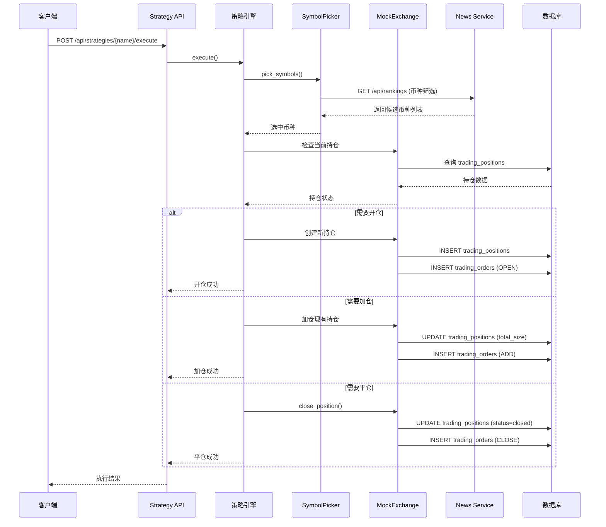
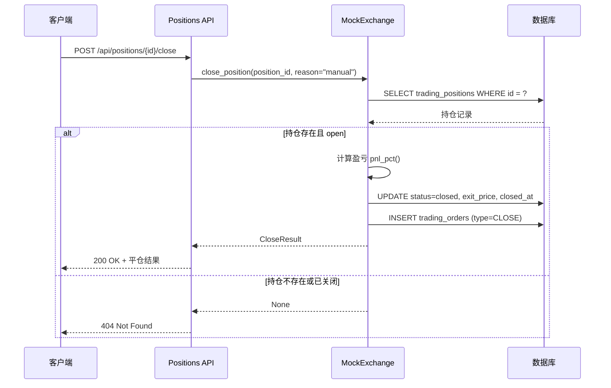
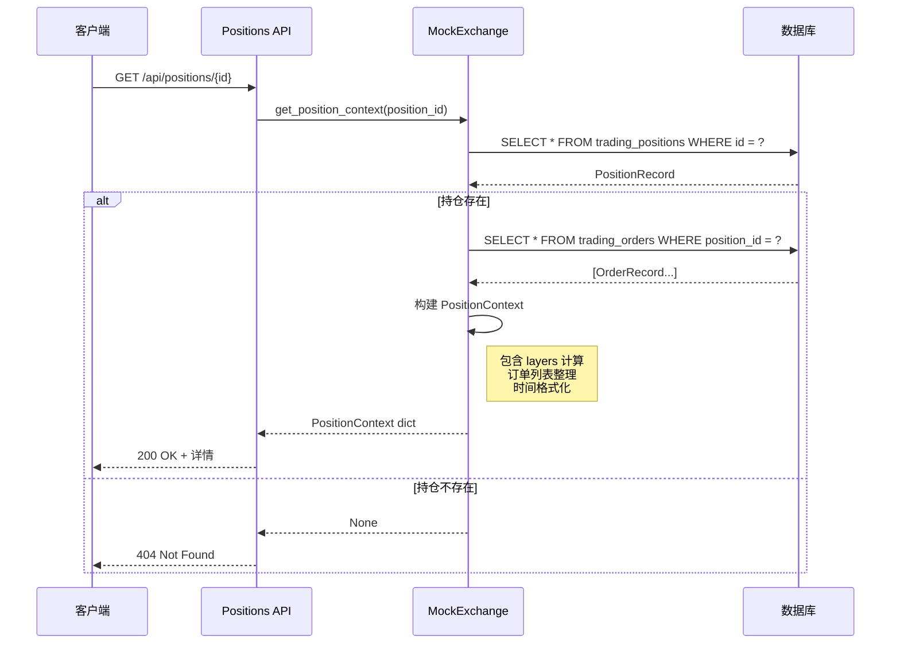
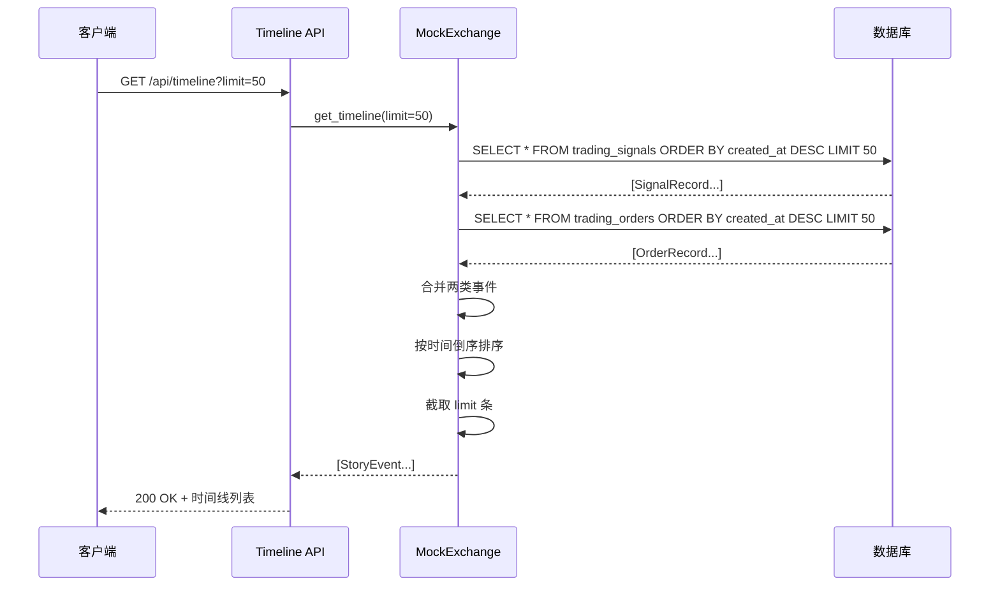
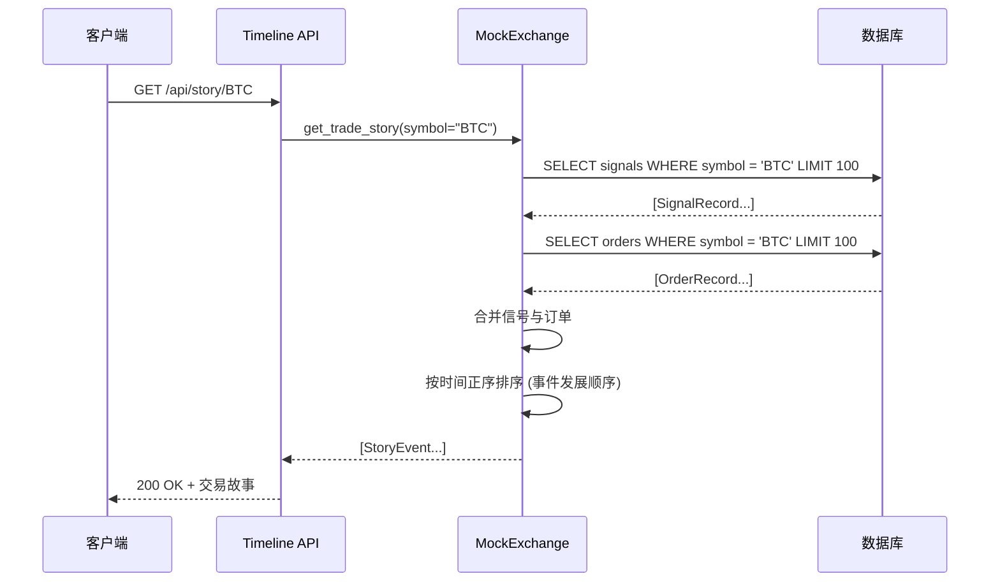
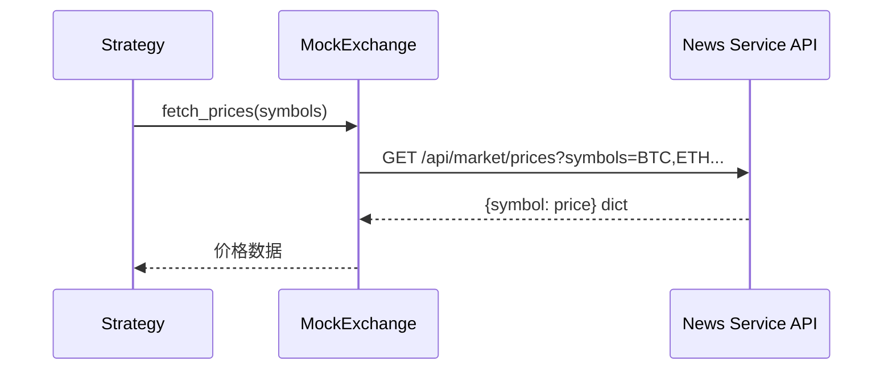
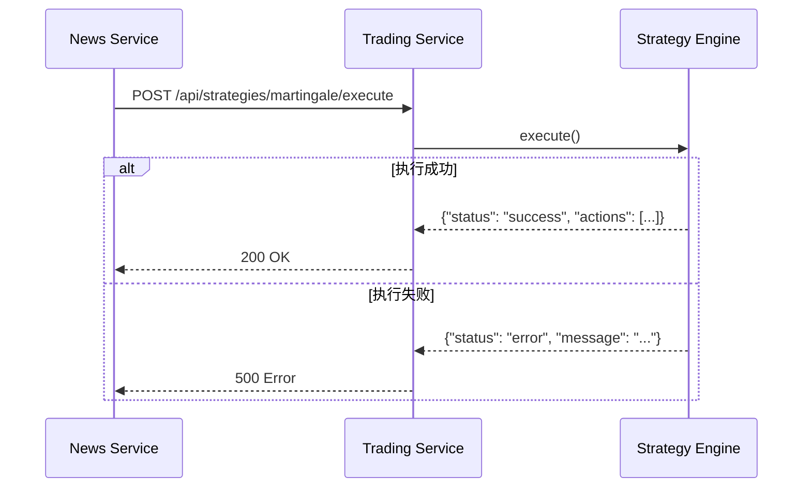
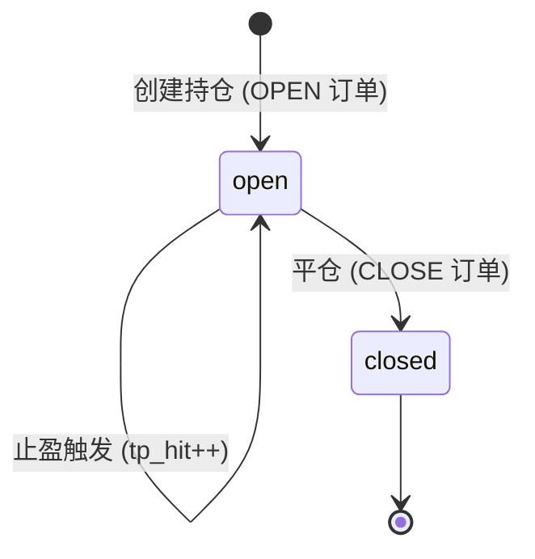
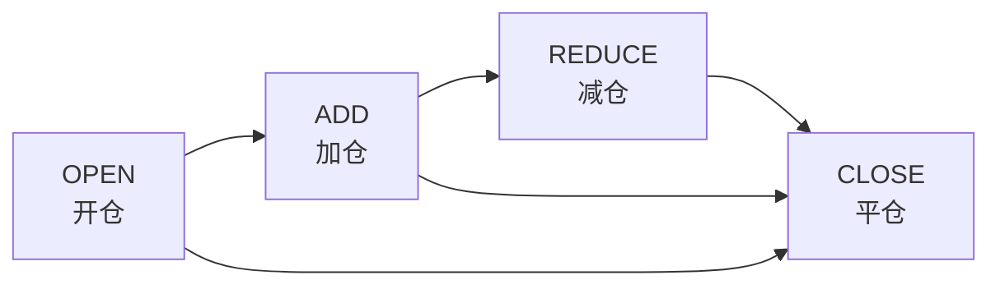

# 数据流程图

## 1. 核心业务流程

### 1.1 策略执行流程



### 1.2 手动平仓流程



---

## 2. 数据查询流程

### 2.1 持仓详情查询



### 2.2 交易时间线查询



### 2.3 交易故事查询 (单 Symbol)



---

## 3. 跨服务数据流

### 3.1 Trading Service → News Service (市场数据)



**其他调用点：**
- 币种排名筛选：`GET /api/rankings`
- K线数据获取：`GET /api/klines/{symbol}`
- 退市币种检查：`GET /api/delistings`

### 3.2 News Service → Trading Service (策略触发)



---

## 4. 数据生命周期

### 4.1 持仓生命周期



**状态说明：**

| 状态 | 说明 | 可执行操作 |
|------|------|------------|
| `open` | 持仓中 | 加仓、减仓、平仓 |
| `closed` | 已平仓 | 查询历史 |

### 4.2 订单类型流转



---

## 5. 数据流汇总图

```mermaid
flowchart TB
    subgraph "输入数据"
        S1[交易信号 Signal]
        S2[市场价格 Price]
        S3[币种排名 Rankings]
        S4[人工指令 Manual]
    end

    subgraph "核心处理"
        P1[策略执行<br/>Strategy.execute()]
        P2[持仓管理<br/>Position lifecycle]
        P3[订单生成<br/>Order creation]
    end

    subgraph "数据存储"
        D1[(trading_signals)]
        D2[(trading_positions)]
        D3[(trading_orders)]
    end

    subgraph "输出数据"
        O1[持仓详情 API]
        O2[订单列表 API]
        O3[时间线 Timeline]
        O4[交易故事 Story]
        O5[策略状态 Status]
    end

    S1 --> D1
    S2 --> P1
    S3 --> P1
    S4 --> P2

    P1 --> P2
    P2 --> P3
    
    P2 --> D2
    P3 --> D3

    D2 --> O1
    D3 --> O2
    D1 --> O3
    D2 --> O3
    D3 --> O3
    D1 --> O4
    D2 --> O4
    D3 --> O4
    P1 --> O5
```
