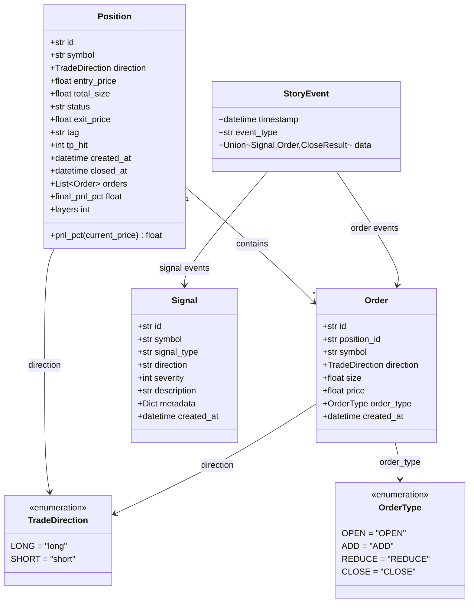
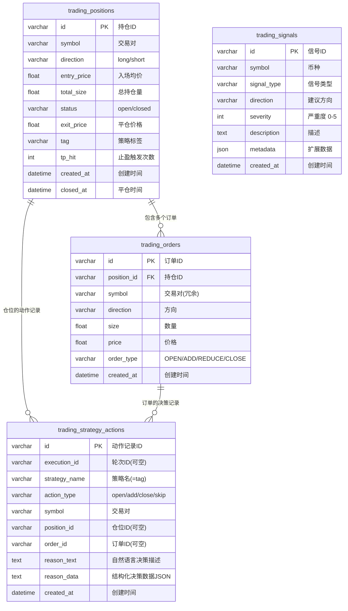

# 领域模型与数据库设计

## 1. 领域模型

### 1.1 核心实体关系图



---

## 2. 枚举类型定义

### 2.1 TradeDirection (交易方向)

**文件**：`trading_service/types.py`

| 值 | 说明 | 盈亏计算 |
|----|------|----------|
| `LONG` | 做多 | `(current - entry) / entry * 100` |
| `SHORT` | 做空 | `(entry - current) / entry * 100` |

### 2.2 OrderType (订单类型)

| 类型 | 说明 | 影响字段 |
|------|------|----------|
| `OPEN` | 开仓 | 创建新 Position |
| `ADD` | 加仓 | Position.total_size += size |
| `REDUCE` | 减仓 | Position.total_size -= size |
| `CLOSE` | 平仓 | Position.status = "closed" |

---

## 2. Repository 模式与数据访问层

### 2.1 架构设计

采用**依赖倒置原则 (DIP)** 设计数据访问层：

```
业务逻辑层 (MockExchange)
    ↓ 依赖抽象
TradingRepository (ABC 抽象接口)
    ↓ 具体实现
SqlalchemyTradingStore (SQLAlchemy ORM)
    ↓ ORM 映射
SQLite Database
```

### 2.2 模块结构

```
repository/
├── __init__.py              # 对外统一导出
├── abc.py                   # 抽象接口定义
│   ├── PositionRecord       # 持仓数据类
│   ├── OrderRecord          # 订单数据类
│   ├── SignalRecord         # 信号数据类
│   └── TradingRepository    # Repository 抽象基类
│
├── sqlalchemy_impl.py       # SQLAlchemy ORM 实现
│   └── SqlalchemyTradingStore
│
└── models/                  # ORM 模型层
    ├── base.py              # Declarative Base
    ├── position.py          # PositionModel
    ├── order.py             # OrderModel
    └── signal.py            # SignalModel
```

### 2.3 数据库 Schema 版本管理

使用 **Alembic** 进行数据库迁移和版本管理：

**工作流程**：
1. 开发人员修改 `repository/models/` 中的 ORM 模型
2. 运行 `alembic revision --autogenerate -m "描述"` 自动生成迁移脚本
3. 检查并调整生成的迁移脚本（`migrations/versions/`）
4. 应用启动时自动检测并执行未完成的迁移

**迁移命令**：
```bash
# 生成迁移脚本
alembic revision --autogenerate -m "add new column to positions"

# 执行到最新版本
alembic upgrade head

# 回退一个版本
alembic downgrade -1

# 查看当前版本
alembic current
```

**启动时自动迁移**：
```python
# app.py - 应用启动生命周期
@asynccontextmanager
async def lifespan(app: FastAPI):
    validate_migrations()  # 自动校验并执行迁移
    yield
```

---

## 3. 数据库表设计

### 3.1 trading_positions (持仓表)

**DDL**:
```sql
CREATE TABLE trading_positions (
    id VARCHAR(12) PRIMARY KEY,
    symbol VARCHAR(20) NOT NULL,
    direction VARCHAR(10) NOT NULL,
    entry_price FLOAT NOT NULL,
    total_size FLOAT NOT NULL,
    status VARCHAR(20) NOT NULL DEFAULT 'open',
    exit_price FLOAT,
    tag VARCHAR(50) DEFAULT '',
    tp_hit INTEGER DEFAULT 0,
    created_at DATETIME NOT NULL,
    closed_at DATETIME
);

CREATE INDEX idx_positions_symbol ON trading_positions(symbol);
CREATE INDEX idx_positions_status ON trading_positions(status);
CREATE INDEX idx_positions_tag ON trading_positions(tag);
```

**字段说明**:

| 字段 | 类型 | 说明 | 示例 |
|------|------|------|------|
| `id` | VARCHAR(12) | 持仓ID (uuid 前12位) | `"a1b2c3d4e5f6"` |
| `symbol` | VARCHAR(20) | 交易对 | `"BTCUSDT"` |
| `direction` | VARCHAR(10) | 方向: long/short | `"long"` |
| `entry_price` | FLOAT | 入场均价 | `42000.5` |
| `total_size` | FLOAT | 总持仓数量 | `0.001` |
| `status` | VARCHAR(20) | 状态: open/closed | `"open"` |
| `exit_price` | FLOAT | 平仓价格 (已平仓时有值) | `43500.0` |
| `tag` | VARCHAR(50) | 策略标签 | `"martingale"` |
| `tp_hit` | INTEGER | 止盈触发次数 | `3` |
| `created_at` | DATETIME | 创建时间 | ISO 格式 |
| `closed_at` | DATETIME | 平仓时间 | ISO 格式 |

### 3.2 trading_orders (订单表)

**DDL**:
```sql
CREATE TABLE trading_orders (
    id VARCHAR(12) PRIMARY KEY,
    position_id VARCHAR(12) NOT NULL,
    symbol VARCHAR(20) NOT NULL,
    direction VARCHAR(10) NOT NULL,
    size FLOAT NOT NULL,
    price FLOAT NOT NULL,
    order_type VARCHAR(20) NOT NULL,
    created_at DATETIME NOT NULL,
    FOREIGN KEY (position_id) REFERENCES trading_positions(id)
);

CREATE INDEX idx_orders_position ON trading_orders(position_id);
CREATE INDEX idx_orders_symbol ON trading_orders(symbol);
CREATE INDEX idx_orders_type ON trading_orders(order_type);
CREATE INDEX idx_orders_created ON trading_orders(created_at DESC);
```

**字段说明**:

| 字段 | 类型 | 说明 | 示例 |
|------|------|------|------|
| `id` | VARCHAR(12) | 订单ID | `"x1y2z3..."` |
| `position_id` | VARCHAR(12) | 关联持仓ID | `"a1b2c3..."` |
| `symbol` | VARCHAR(20) | 交易对 (冗余，便于查询) | `"BTCUSDT"` |
| `direction` | VARCHAR(10) | 方向 | `"long"` |
| `size` | FLOAT | 本次订单数量 | `0.0005` |
| `price` | FLOAT | 成交价格 | `42100.0` |
| `order_type` | VARCHAR(20) | 订单类型 | `"ADD"` |

> **注意**：Order 表不再包含 `reason` 字段。下单原因（决策上下文）已移至 `trading_strategy_actions` 表，通过 `order_id` 关联。详见 3.5 节。

### 3.3 trading_signals (信号表)

**DDL**:
```sql
CREATE TABLE trading_signals (
    id VARCHAR(12) PRIMARY KEY,
    symbol VARCHAR(20) NOT NULL,
    signal_type VARCHAR(50) NOT NULL,
    direction VARCHAR(10),
    severity INTEGER DEFAULT 0,
    description TEXT,
    metadata JSON,
    created_at DATETIME NOT NULL
);

CREATE INDEX idx_signals_symbol ON trading_signals(symbol);
CREATE INDEX idx_signals_type ON trading_signals(signal_type);
CREATE INDEX idx_signals_severity ON trading_signals(severity DESC);
CREATE INDEX idx_signals_created ON trading_signals(created_at DESC);
```

**字段说明**:

| 字段 | 类型 | 说明 | 示例 |
|------|------|------|------|
| `id` | VARCHAR(12) | 信号ID | `"s1g2n3..."` |
| `symbol` | VARCHAR(20) | 币种 | `"BTC"` |
| `signal_type` | VARCHAR(50) | 信号类型 | `"news_surge"` |
| `direction` | VARCHAR(10) | 建议方向 | `"bullish"` |
| `severity` | INTEGER | 严重度 (0-5) | `3` |
| `description` | TEXT | 描述 | `"比特币 ETF 通过"` |
| `metadata` | JSON | 扩展字段 | `{"source": "twitter", ...}` |

---

## 4. ER 关系图



---

## 5. 领域对象转换

### 5.1 转换流程

```
DB Record → Domain Object → API Response
```

### 5.2 Position 转换链

```mermaid
graph LR
    A[PositionRecord<br/>DB 记录] --> B[Position<br/>领域对象]
    B --> C[PositionContext<br/>API 响应]
    
    A: id<br/>symbol<br/>direction<br/>entry_price<br/>total_size<br/>...
    
    B: id<br/>symbol<br/>direction (Enum)<br/>entry_price<br/>total_size<br/>orders: List[Order]<br/>+pnl_pct(price)<br/>+layers
    
    C: id<br/>symbol<br/>direction<br/>entry_price<br/>total_size<br/>layers<br/>orders: List[dict]<br/>...
```

### 5.3 关键转换方法

**Position.from_record()**:
```python
@classmethod
def from_record(cls, record: PositionRecord, orders: list[OrderRecord] | None = None) -> Position:
    pos = cls(
        id=record.id,
        symbol=record.symbol,
        direction=TradeDirection(record.direction),
        entry_price=record.entry_price,
        total_size=record.total_size,
        # ... 其他字段
    )
    if orders:
        pos.orders = [Order.from_record(o) for o in orders]
    return pos
```

**Position.to_record()**:
```python
def to_record(self) -> PositionRecord:
    return PositionRecord(
        id=self.id,
        symbol=self.symbol,
        direction=self.direction.value,  # Enum → str
        entry_price=self.entry_price,
        total_size=self.total_size,
        # ...
    )
```

---

## 6. 业务计算方法

### 6.1 Position.pnl_pct(current_price)

**用途**：计算当前浮动盈亏百分比

**公式**：
```
做多: (当前价 - 入场价) / 入场价 * 100
做空: (入场价 - 当前价) / 入场价 * 100
```

**示例**：
```python
# 做多 BTC，入场 40000，当前 42000
pos.pnl_pct(42000)  # → 5.0%

# 做空 BTC，入场 40000，当前 38000
pos.pnl_pct(38000)  # → 5.0%
```

### 6.2 layers 计算

**用途**：显示马丁格尔加仓层数

**公式**：
```
layers = ADD 订单数 + 1 (初始仓位)
```

**代码**：
```python
layers = len([o for o in pos.orders if o.order_type == OrderType.ADD]) + 1
```

---

## 7. 数据一致性设计

### 7.1 写入原则

- **先写 Position，再写 Order**（外键约束）
- **持仓更新与订单写入应在同一事务**
- 状态变更必须有对应的订单记录

### 7.2 典型事务场景

**开仓事务**：
```sql
BEGIN TRANSACTION;
INSERT INTO trading_positions (...);
INSERT INTO trading_orders (..., order_type='OPEN');
COMMIT;
```

**加仓事务**：
```sql
BEGIN TRANSACTION;
UPDATE trading_positions SET total_size = total_size + ? WHERE id = ?;
INSERT INTO trading_orders (..., order_type='ADD');
COMMIT;
```

**平仓事务**：
```sql
BEGIN TRANSACTION;
UPDATE trading_positions SET status='closed', exit_price=?, closed_at=? WHERE id=?;
INSERT INTO trading_orders (..., order_type='CLOSE');
COMMIT;
```

> **注意**：当前 `SqlalchemyTradingStore (repository/sqlalchemy_impl.py)` 尚未实现事务，这是待优化项。
