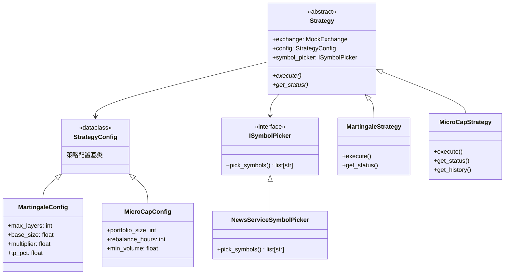
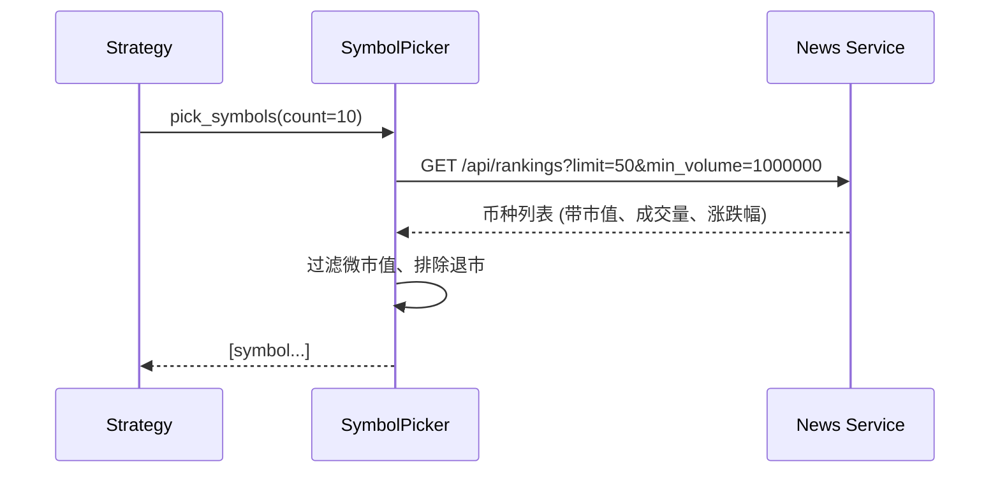
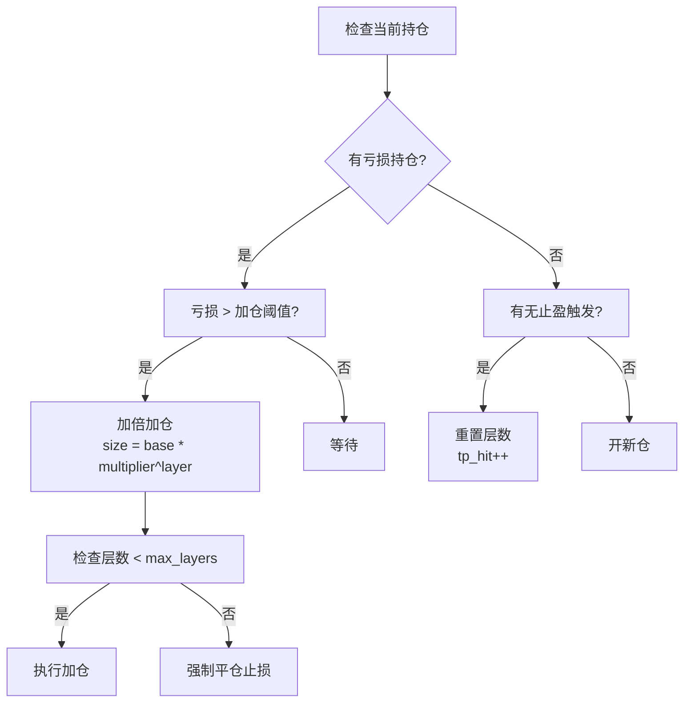
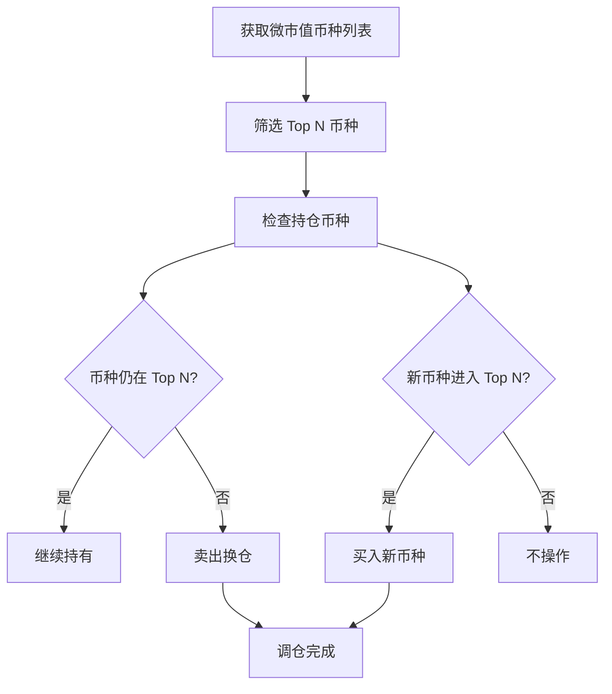

# 策略引擎设计

## 1. 策略引擎架构

### 1.1 核心类层次结构



---

## 2. 策略基类设计

### 2.1 Strategy 抽象基类

**文件**：`trading_service/strategies/base.py`

```python
@dataclass
class StrategyConfig:
    """策略配置基类"""

class Strategy(ABC):
    def __init__(
        self,
        exchange: MockExchange,
        config: StrategyConfig,
        symbol_picker: ISymbolPicker,
    ) -> None:
        self.exchange = exchange
        self.config = config
        self.symbol_picker = symbol_picker

    @abstractmethod
    async def execute(self) -> None:
        """执行策略 - 核心逻辑入口"""

    @abstractmethod
    def get_status(self) -> dict:
        """获取策略当前状态 - 用于 API 响应"""
```

**设计原则**：
1. **依赖注入**：所有外部依赖通过构造函数注入
2. **单一职责**：Strategy 只负责策略逻辑，不处理数据存储
3. **异步执行**：`execute()` 是 async 方法，支持耗时操作
4. **状态暴露**：`get_status()` 提供人类可读的状态信息

---

## 3. 币种选择器

### 3.1 ISymbolPicker 接口

```python
class ISymbolPicker(ABC):
    @abstractmethod
    async def pick_symbols(self, count: int) -> list[str]:
        """选择符合策略条件的币种"""
```

### 3.2 实现说明

当前实现通过 **News Service API** 获取：
- 币种市值排名
- 24h 成交量筛选
- 涨跌幅过滤
- 退市币种排除

**调用流程**：


---

## 4. 马丁格尔策略 (Martingale)

### 4.1 策略原理



### 4.2 配置参数 (MartingaleConfig)

| 参数 | 类型 | 默认 | 说明 |
|------|------|------|------|
| `max_layers` | int | 5 | 最大加仓层数 |
| `base_size` | float | 0.001 | 初始仓位大小 |
| `multiplier` | float | 2.0 | 加仓倍率 (马丁核心) |
| `tp_pct` | float | 1.0 | 止盈百分比 |
| `add_threshold_pct` | float | -2.0 | 加仓触发阈值 (亏损) |

### 4.3 仓位大小计算公式

```
第 0 层 (初始): size = base_size
第 1 层: size = base_size * multiplier
第 2 层: size = base_size * multiplier^2
...
第 N 层: size = base_size * multiplier^N
```

**累计持仓**:
```
total_size = base_size * (multiplier^(n+1) - 1) / (multiplier - 1)
```

**盈亏平衡点 (做多为例)**:
```
breakeven_price = Σ(price_i * size_i) / total_size
```

---

## 5. 微市值策略 (MicroCap)

### 5.1 策略原理



### 5.2 配置参数 (MicroCapConfig)

| 参数 | 类型 | 默认 | 说明 |
|------|------|------|------|
| `portfolio_size` | int | 10 | 持仓币种数量 |
| `rebalance_hours` | int | 24 | 调仓间隔 (小时) |
| `min_volume_24h` | float | 1,000,000 | 最低 24h 成交量 ($) |
| `max_market_cap_rank` | int | 200 | 最大市值排名 |
| `equal_weight` | bool | True | 是否等权重分配 |

### 5.3 调仓逻辑

1. **获取候选池**：市值 100-200 名，成交量 > $1M
2. **评分排序**：结合波动率、成交量、社交热度
3. **组合构建**：等权重分配资金到 Top N 币种
4. **调仓执行**：
   - 移出不在 Top N 的币种
   - 买入新进入 Top N 的币种
   - 调整仓位至目标权重

---

## 6. 策略执行流程

### 6.1 通用执行流程


### 6.2 策略触发方式

| 触发方式 | 说明 | 实现 |
|----------|------|------|
| **API 触发** | 显式调用策略接口 | `POST /api/strategies/{name}/execute` |
| **定时任务** | News Service Cron 定时调用 | 由 News Service 调度 |
| **信号触发** | 基于 News Service 事件触发 | Webhook / 轮询 |

---

## 7. 策略状态报告

每个策略必须实现 `get_status()` 方法，返回结构化状态信息。

### 7.1 状态格式规范

```python
{
    "strategy": "martingale",           # 策略名称
    "config": { ... },                  # 当前配置摘要
    "active_positions": 3,              # 活跃持仓数
    "total_layers": 7,                  # 总加仓层数
    "statistics": {                     # 统计数据
        "total_trades": 42,
        "win_rate": 0.72,
        "avg_profit_pct": 1.2,
    },
    "last_execution": {                 # 上次执行情况
        "timestamp": "2024-01-15T10:30:00Z",
        "actions_performed": ["add_layer", "take_profit"],
    }
}
```

---

## 8. 策略扩展指南

### 8.1 新增策略步骤

1. **定义配置类**（继承 `StrategyConfig`）
2. **实现策略类**（继承 `Strategy`）
3. **注册 API 路由**（`api/strategies.py`）
4. **添加工厂函数**（`api/deps.py`）

### 8.2 模板代码

```python
from dataclasses import dataclass
from trading_service.strategies.base import Strategy, StrategyConfig

@dataclass
class MyStrategyConfig(StrategyConfig):
    param1: int = 100
    param2: float = 0.5

class MyStrategy(Strategy):
    def __init__(self, exchange, config: MyStrategyConfig, symbol_picker):
        super().__init__(exchange, config, symbol_picker)

    async def execute(self) -> dict:
        """策略核心逻辑"""
        # 1. 获取市场数据
        # 2. 检查当前持仓
        # 3. 生成交易决策
        # 4. 执行交易
        return {"status": "success", "actions": [...]}

    def get_status(self) -> dict:
        """返回策略状态"""
        return {
            "strategy": "my_strategy",
            "config": {...},
            # ...
        }
```

---

## 9. 测试策略

### 9.1 单元测试要点

1. **Mock 外部依赖**：
   - MockExchange → 返回固定持仓
   - MockSymbolPicker → 返回固定币种列表

2. **测试边界条件**：
   - max_layers = 0（禁止加仓）
   - 连续亏损场景
   - 止盈触发场景

3. **验证数据库交互**：
   - 检查 Position 状态变更
   - 验证 Order 记录正确写入

### 9.2 回测支持

> **待实现**：策略引擎应支持回测模式
> - 历史数据回放
> - 无副作用执行
> - 绩效指标输出

---

## 10. 风险控制设计

### 10.1 内置风控机制

| 风控点 | 实现位置 | 说明 |
|--------|----------|------|
| **最大层数限制** | Martingale | 防止无限加仓 |
| **单笔最大仓位** | Strategy 基类 | 限制单笔交易大小 |
| **单日最大亏损** | 待实现 | 单日亏损超过阈值停止 |
| **黑名單币种** | SymbolPicker | 排除高风险币种 |

### 10.2 紧急止损

API 提供手动平仓接口，策略执行也可触发强制平仓：

```python
# 策略内强制止损
if position.pnl_pct(current_price) < -20.0:  # 亏损超 20%
    self.exchange.close_position(position.id, reason="stop_loss")
```
