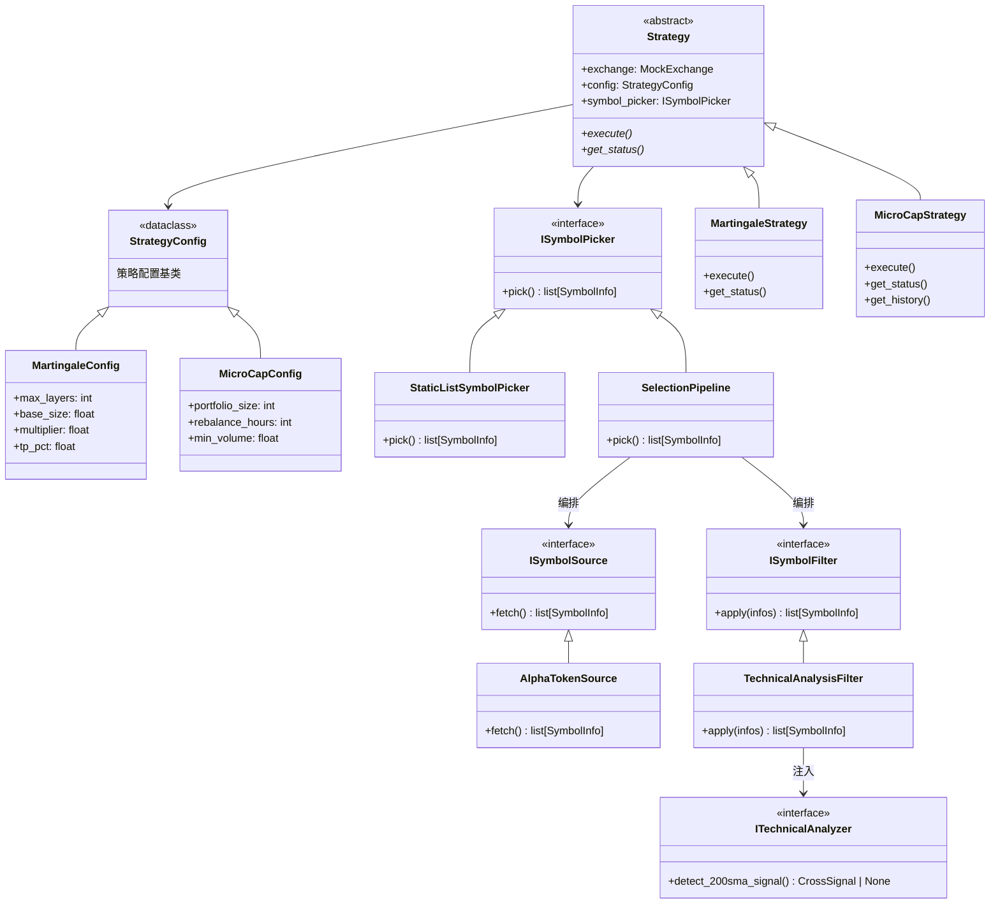
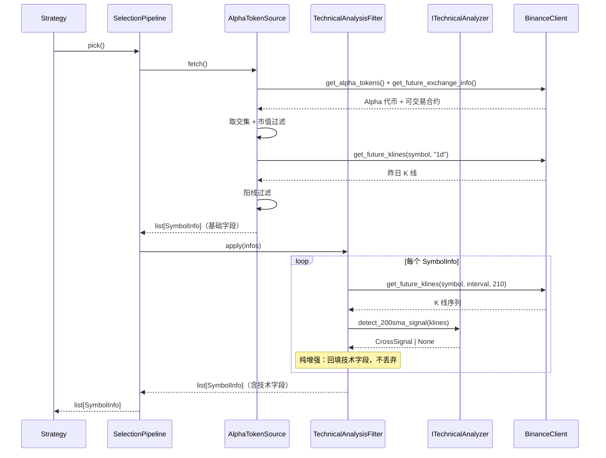
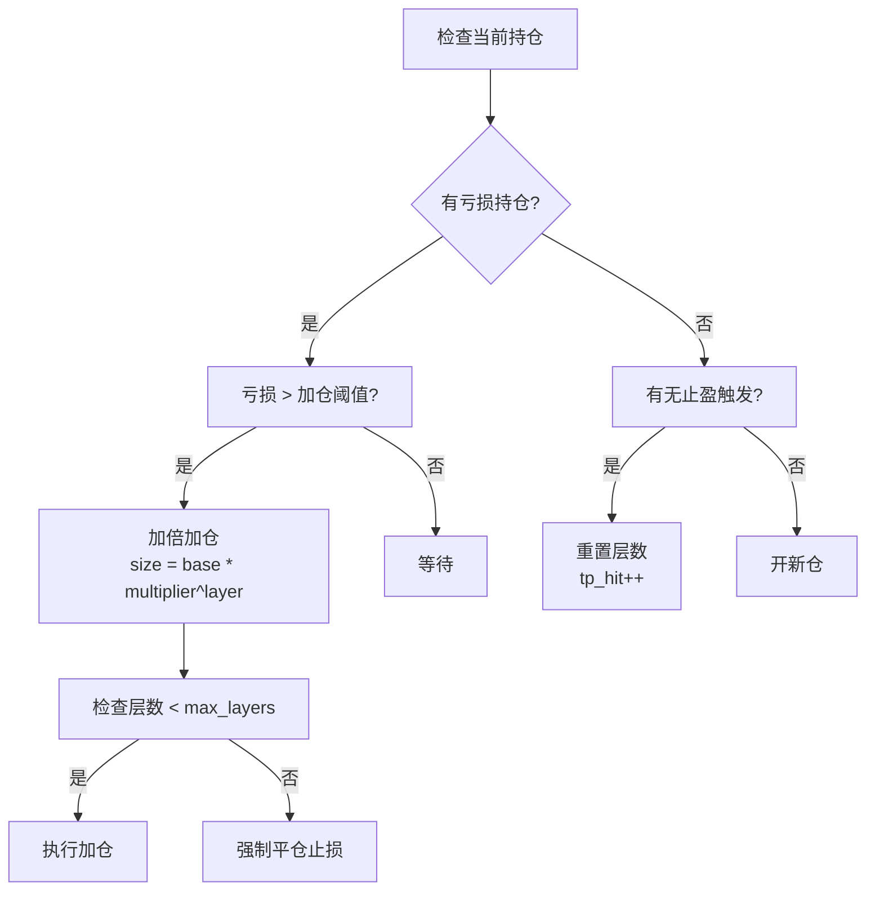
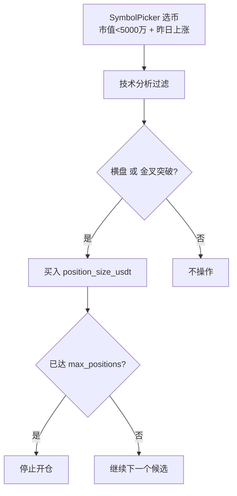
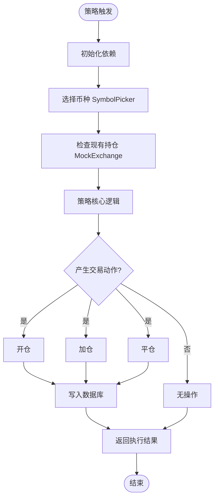

# 策略引擎设计

## 1. 策略引擎架构

### 1.1 核心类层次结构



---

## 2. 策略基类设计

### 2.1 Strategy 抽象基类

**文件**：`trading_service/strategies/base.py`

```python
@dataclass
class StrategyConfig:
    """策略配置基类"""

class Strategy(ABC):
    def __init__(
        self,
        exchange: MockExchange,
        config: StrategyConfig,
        symbol_picker: ISymbolPicker,
    ) -> None:
        self.exchange = exchange
        self.config = config
        self.symbol_picker = symbol_picker

    @abstractmethod
    async def execute(self) -> None:
        """执行策略 - 核心逻辑入口"""

    @abstractmethod
    def get_status(self) -> dict:
        """获取策略当前状态 - 用于 API 响应"""
```

**设计原则**：
1. **依赖注入**：所有外部依赖通过构造函数注入
2. **单一职责**：Strategy 只负责策略逻辑，不处理数据存储
3. **异步执行**：`execute()` 是 async 方法，支持耗时操作
4. **状态暴露**：`get_status()` 提供人类可读的状态信息

---

## 3. 选币管道

> **模块位置**：`trading_service/pickers/`（统一存放选币管道与技术分析器，禁止放在 `strategies/` 下，由架构契约测试 `tests/architecture/test_contracts.py` 强制守护）

### 3.1 设计动机

选币与技术分析是两个独立的关注点，原先通过 `SimpleAlphaSymbolPicker(enable_technical_filter=True)`
的 bool 开关耦合在一起，导致：选币器背负两个职责、`SymbolInfo` 成为 God Struct、
新增分析阶段只能继续往选币器里塞。重构为 **source -> filter -> 策略** 的管道模式后，
技术分析成为独立、可组合的阶段，选币器回归纯净。

### 3.2 三层抽象

| 抽象 | 职责 | 语义 |
|------|------|------|
| `ISymbolSource` | 数据从哪来 | 生成器：`fetch()` 从无到有产出 `list[SymbolInfo]` |
| `ISymbolFilter` | 怎么处理/增强 | 转换器：`apply(infos)` 接收并返回 `list[SymbolInfo]` |
| `SelectionPipeline` | 编排 source + filters | 实现 `ISymbolPicker.pick()`，对策略层透明 |

> **为何 source/filter 分离而非统一 `ISymbolStage`：** source 是"生成器"语义，
> filter 是"转换器"语义。统一接口会迫使第一个阶段接收空列表、语义别扭。分离后
> 每个接口职责单一，精确映射"选币 -> 技术分析"心智模型。

```python
class ISymbolSource(ABC):
    @abstractmethod
    async def fetch(self) -> list[SymbolInfo]: ...

class ISymbolFilter(ABC):
    @abstractmethod
    async def apply(self, infos: list[SymbolInfo]) -> list[SymbolInfo]: ...

class SelectionPipeline(ISymbolPicker):
    def __init__(self, source: ISymbolSource, filters: list[ISymbolFilter] | None = None): ...
    async def pick(self) -> list[SymbolInfo]:
        infos = await self.source.fetch()
        for f in self.filters:
            infos = await f.apply(infos)
        return infos
```

### 3.3 策略层契约（不变）

策略只依赖 `ISymbolPicker.pick()`，与管道实现无关：

```python
class ISymbolPicker(ABC):
    @abstractmethod
    async def pick(self) -> list[SymbolInfo]:
        """筛选符合条件的币种，返回带市场数据与技术指标的 SymbolInfo 列表。"""
```

**设计要点**：
- `pick()` 为 **async** 方法，同步 IO 实现需用 `run_in_executor` 包装
- 返回 `list[SymbolInfo]`（富数据载体），而非裸 `list[str]`
- `SymbolInfo` 定义在 `pickers/base.py`，包含基础字段、Alpha 扩展字段、技术分析字段三组
  （技术字段由 `TechnicalAnalysisFilter` 回填，数据源只填基础字段）

### 3.4 实现类

| 类 | 接口 | 数据源 | 用途 |
|----|------|--------|------|
| `StaticListSymbolPicker` | `ISymbolPicker` | 静态字符串列表 | 测试 / DI 占位（Martingale） |
| `AlphaTokenSource` | `ISymbolSource` | 币安 Alpha 代币 API + 合约日 K | 真实选币（基础筛选，不含技术分析） |
| `TechnicalAnalysisFilter` | `ISymbolFilter` | 合约 K 线 + `ITechnicalAnalyzer` | 纯增强：回填 200 均线技术字段，不丢弃 |
| `SelectionPipeline` | `ISymbolPicker` | source + filters 编排 | 组合 source 与 filter，对策略透明 |

**AlphaTokenSource 筛选条件**（只做基础筛选）：
1. Alpha 代币，市值 5000 万 USDT 以下
2. 在合约交易所存在且处于可交易状态（status=="TRADING", quoteAsset=="USDT"）
3. 昨日 K 线为阳线（收盘价 >= 开盘价）

> MicroCapStrategy 通过 `SelectionPipeline(source=AlphaTokenSource(...), filters=[TechnicalAnalysisFilter(...)])`
> 组合选币与技术分析。MartingaleStrategy 直接用 `StaticListSymbolPicker`。

### 3.5 调用流程



### 3.6 客户端协议（降低耦合）

`AlphaTokenSource` 与 `TechnicalAnalysisFilter` 不依赖具体的 `BinanceClient`，
而是依赖 `clients/protocols.py` 中定义的结构化协议（Protocol）：

| 协议 | 方法 | 消费者 |
|------|------|--------|
| `KlineClient` | `get_future_klines` | `TechnicalAnalysisFilter` |
| `MarketDataClient` | `+ get_alpha_tokens` / `get_future_exchange_info` | `AlphaTokenSource` |

`BinanceClient` 在结构上满足这些协议，无需显式继承；测试可注入内存实现（duck typing）。

---

## 4. 技术分析器

### 4.1 ITechnicalAnalyzer 接口

```python
class ITechnicalAnalyzer(ABC):
    @abstractmethod
    def detect_200sma_signal(
        self,
        klines: list[BinanceFutureKline],
        symbol: str,
        check_last_n: int = 10,
        near_threshold: float = 5.0,
        sideways_threshold: float = 20.0,
    ) -> CrossSignal | None:
        """检测 200 均线穿越信号（金叉/死叉/靠近均线）。"""
```

**设计要点**：
- 通过**依赖注入**提供给 `TechnicalAnalysisFilter`（构造函数 `analyzer` 参数），便于单元测试替换 mock
- `TechnicalAnalyzer` 是默认实现，提供 SMA 计算、200 均线穿越信号检测、底部横盘判定
- 所有计算方法无状态，可安全共享单例
- `TechnicalAnalysisFilter` 是**纯增强**：analyzer 返回 None 时 SymbolInfo 数量不减、技术字段保持默认；买入信号判定由策略负责（`MicroCapStrategy._is_buy_signal`）

### 4.2 信号类型

`CrossSignal` 数据结构：

| 字段 | 类型 | 说明 |
|------|------|------|
| `cross_type` | `CrossSignalType` | `GOLDEN`(金叉) / `DEAD`(死叉) / `NEAR`(靠近均线) |
| `cross_ago` | int | 多少根 K 线前发生的穿越（0 为刚发生） |
| `sma_200` | float | 200 均线价格 |
| `distance_percent` | float | 价格相对均线的距离百分比 |
| `volatility_10` | float | 最近 10 根 K 线波动率 |
| `is_sideways` | bool | 是否处于底部横盘 |

### 4.3 优先级

信号检测优先级：**金叉/死叉穿越 > 靠近均线**。无穿越且远离均线（距离 > near_threshold）时返回 `None`。

---

## 5. 马丁格尔策略 (Martingale)

### 4.1 策略原理



### 4.2 配置参数 (MartingaleConfig)

| 参数 | 类型 | 默认 | 说明 |
|------|------|------|------|
| `max_layers` | int | 5 | 最大加仓层数 |
| `base_size` | float | 0.001 | 初始仓位大小 |
| `multiplier` | float | 2.0 | 加仓倍率 (马丁核心) |
| `tp_pct` | float | 1.0 | 止盈百分比 |
| `add_threshold_pct` | float | -2.0 | 加仓触发阈值 (亏损) |

### 4.3 仓位大小计算公式

```
第 0 层 (初始): size = base_size
第 1 层: size = base_size * multiplier
第 2 层: size = base_size * multiplier^2
...
第 N 层: size = base_size * multiplier^N
```

**累计持仓**:
```
total_size = base_size * (multiplier^(n+1) - 1) / (multiplier - 1)
```

**盈亏平衡点 (做多为例)**:
```
breakeven_price = Σ(price_i * size_i) / total_size
```

---

## 6. 微市值策略 (MicroCap)

### 5.1 策略原理



**买入信号判定**（`_is_buy_signal`）：
- `is_sideways_bottom == True`：底部横盘（低波动 + 价格在 200 均线上方）
- `cross_signal == CrossSignalType.GOLDEN`：金叉，收盘价从下向上突破 200 均线（近期突破）

> 选币与技术分析由 `SelectionPipeline(source=AlphaTokenSource, filters=[TechnicalAnalysisFilter])` 完成，策略只消费 `SymbolInfo` 的技术字段。

### 5.2 配置参数 (MicroCapConfig)

| 参数 | 类型 | 默认 | 说明 |
|------|------|------|------|
| `max_positions` | int | 10 | 最大同时持仓数 |
| `position_size_usdt` | float | 10.0 | 单笔买入金额（USDT） |
| `take_profit_pct` | float | 5.0 | 止盈百分比（下一轮实现） |
| `stop_loss_pct` | float | 15.0 | 止损百分比（下一轮实现） |
| `min_volume_usdt` | float | 1,000,000 | 最低 24h 成交量（由选币器使用） |
| `max_market_cap` | float | 50,000,000 | 最大市值（由选币器使用） |

### 5.3 入场逻辑

1. **检查配额**：当前 `tag="micro_cap"` 的 open 持仓数 >= `max_positions` 则直接返回
2. **选币**：`symbol_picker.pick()` 返回候选 `SymbolInfo`（已含技术分析字段）
3. **过滤**：排除已持仓 symbol；只保留 `_is_buy_signal` 通过的
4. **开仓**：按 `max_positions - current_count` 配额，对候选开多仓
   - `size = position_size_usdt`（10 USDT）
   - `reason` 区分 `micro_cap_entry_sideways` / `micro_cap_entry_breakout`

> 止盈/止损、调仓换仓留待后续迭代。

---

## 7. 策略执行流程

### 6.1 通用执行流程



### 6.2 策略触发方式

| 触发方式 | 说明 | 实现 |
|----------|------|------|
| **API 触发** | 显式调用策略接口 | `POST /api/strategies/{name}/execute` |
| **定时任务** | News Service Cron 定时调用 | 由 News Service 调度 |
| **信号触发** | 基于 News Service 事件触发 | Webhook / 轮询 |

---

## 8. 策略状态报告

每个策略必须实现 `get_status()` 方法，返回结构化状态信息。

### 7.1 状态格式规范

```python
{
    "strategy": "martingale",           # 策略名称
    "config": { ... },                  # 当前配置摘要
    "active_positions": 3,              # 活跃持仓数
    "total_layers": 7,                  # 总加仓层数
    "statistics": {                     # 统计数据
        "total_trades": 42,
        "win_rate": 0.72,
        "avg_profit_pct": 1.2,
    },
    "last_execution": {                 # 上次执行情况
        "timestamp": "2024-01-15T10:30:00Z",
        "actions_performed": ["add_layer", "take_profit"],
    }
}
```

---

## 9. 策略扩展指南

### 8.1 新增策略步骤

1. **定义配置类**（继承 `StrategyConfig`）
2. **实现策略类**（继承 `Strategy`）
3. **注册 API 路由**（`api/strategies.py`）
4. **添加工厂函数**（`api/deps.py`）

### 8.2 模板代码

```python
from dataclasses import dataclass
from trading_service.strategies.base import Strategy, StrategyConfig

@dataclass
class MyStrategyConfig(StrategyConfig):
    param1: int = 100
    param2: float = 0.5

class MyStrategy(Strategy):
    def __init__(self, exchange, config: MyStrategyConfig, symbol_picker):
        super().__init__(exchange, config, symbol_picker)

    async def execute(self) -> dict:
        """策略核心逻辑"""
        # 1. 获取市场数据
        # 2. 检查当前持仓
        # 3. 生成交易决策
        # 4. 执行交易
        return {"status": "success", "actions": [...]}

    def get_status(self) -> dict:
        """返回策略状态"""
        return {
            "strategy": "my_strategy",
            "config": {...},
            # ...
        }
```

---

## 10. 测试策略

### 9.1 单元测试要点

1. **Mock 外部依赖**：
   - MockExchange → 返回固定持仓
   - MockSymbolPicker → 返回固定币种列表

2. **测试边界条件**：
   - max_layers = 0（禁止加仓）
   - 连续亏损场景
   - 止盈触发场景

3. **验证数据库交互**：
   - 检查 Position 状态变更
   - 验证 Order 记录正确写入

### 9.2 回测支持

> **待实现**：策略引擎应支持回测模式
> - 历史数据回放
> - 无副作用执行
> - 绩效指标输出

---

## 11. 风险控制设计

### 10.1 内置风控机制

| 风控点 | 实现位置 | 说明 |
|--------|----------|------|
| **最大层数限制** | Martingale | 防止无限加仓 |
| **单笔最大仓位** | Strategy 基类 | 限制单笔交易大小 |
| **单日最大亏损** | 待实现 | 单日亏损超过阈值停止 |
| **黑名單币种** | SymbolPicker | 排除高风险币种 |

### 10.2 紧急止损

API 提供手动平仓接口，策略执行也可触发强制平仓：

```python
# 策略内强制止损
if position.pnl_pct(current_price) < -20.0:  # 亏损超 20%
    self.exchange.close_position(position.id, reason="stop_loss")
```
