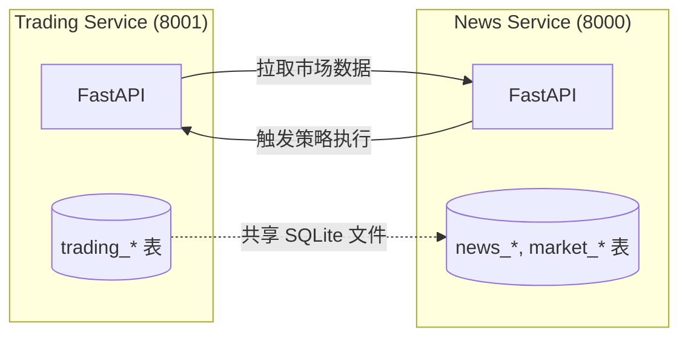
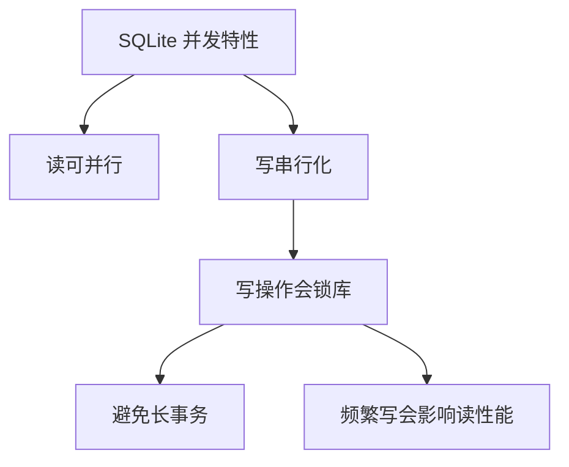
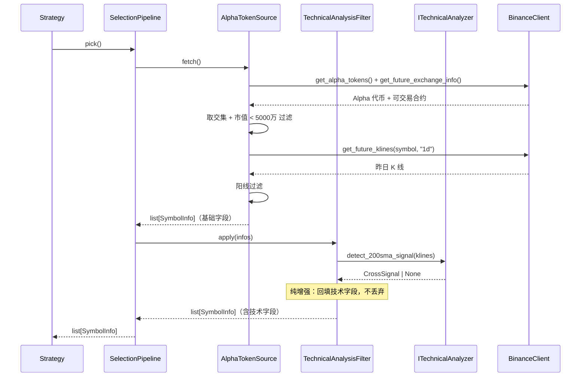
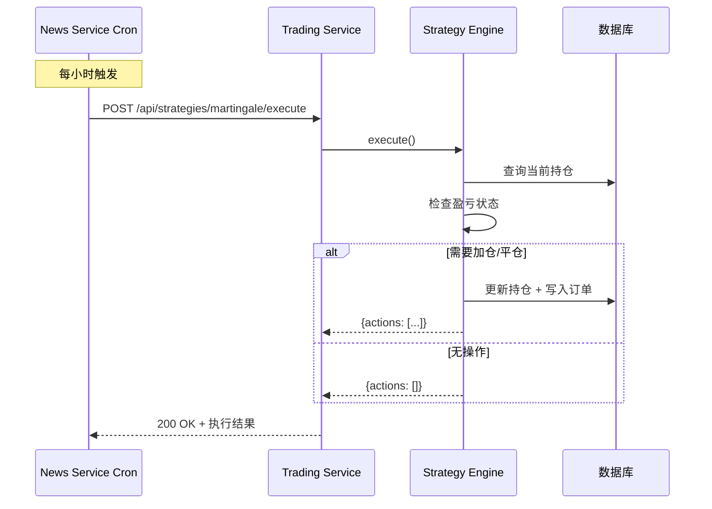
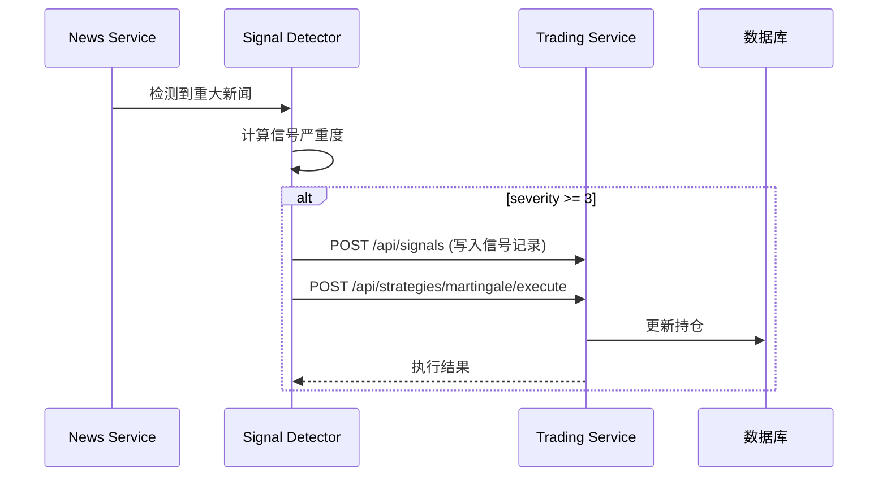

# 跨服务集成设计

## 1. 集成总览

Trading Service 与 News Service 采用 **共享数据库 + 双向 HTTP API** 的集成模式。



### 1.1 集成方式对比

| 集成方式 | 适用场景 | 当前使用 |
|----------|----------|----------|
| **共享数据库** | 两服务紧密协作，数据强一致 | ✅ 使用 |
| **HTTP API** | 异步操作，跨服务调用 | ✅ 使用 |
| **消息队列** | 高吞吐解耦 | ❌ 暂不使用 |
| **gRPC** | 高性能内部调用 | ❌ 暂不使用 |

---

## 2. 共享数据库设计

### 2.1 数据库文件位置

```
~/projects/news-service/news.db
```

### 2.2 表命名空间约定

| 表前缀 | 归属服务 | 说明 |
|--------|----------|------|
| `news_*` | News Service | 新闻、爬取、原始数据 |
| `market_*` | News Service | 市场数据、K线、市值排名 |
| `trading_*` | Trading Service | 持仓、订单、信号 |

### 2.3 跨服务数据访问规则

**Trading Service 只读 News Service 表**：
- `market_klines` - K线数据
- `market_rankings` - 市值排名
- `news_articles` - 新闻文章

**Trading Service 自己管理 `trading_signals` 表**：
- 信号由 Trading Service 的信号检测器（`SignalDetector` 子类）产出并落盘
- 信号检测器与策略平行，由调度器定时调度
- 信号可被策略消费（驱动交易），也可不被消费（仅用于内容生成）
- 外部服务（如 News Service）如需传递信号，应通过 `POST /api/signals` API 调用，不直接写共享表

### 2.4 SQLite 并发注意事项



**最佳实践**：
- 控制事务大小，长操作分批执行
- 写操作尽量合并，减少锁竞争
- 考虑 WAL 模式提升并发读性能

---

## 3. Trading Service → News Service 调用

### 3.1 调用点汇总

| 调用方 | 接口 | 用途 | 频率 |
|--------|------|------|------|
| `MockExchange` | `GET /api/market/prices` | 获取最新价格、盈亏计算（占位实现，待接入） | 策略执行时 |
| `Strategy` | `GET /api/delistings` | 退市币种黑名单 | 每日一次 |

> **说明**：币种筛选（`AlphaTokenSource`）与技术分析（`TechnicalAnalysisFilter` + `ITechnicalAnalyzer`）当前通过 `BinanceClient` 直接调用币安 API 获取 Alpha 代币列表、合约交易所信息与 K 线数据，不经过 News Service。后续计划通过 News Service API 获取数据（当前为 stub）。

### 3.2 HTTP 客户端配置

**配置项**（`config.py`）：
| 配置 | 值 | 说明 |
|------|----|------|
| `news_service_base_url` | `http://127.0.0.1:8000` | News Service 地址 |
| `news_service_timeout` | `30` | 超时时间（秒） |

### 3.3 币种筛选数据流

选币管道（`SelectionPipeline`）直接调用币安 API（不经 News Service）：



### 3.4 容错设计

**重试机制**：
```python
# 建议实现：
# - 连接失败重试 3 次
# - 指数退避: 1s, 2s, 4s
# - 超时保护: 30s
```

**降级策略**：
- News Service 不可用时，使用缓存数据
- 策略执行标记为部分成功
- 写入错误日志，不阻塞主流程

---

## 4. News Service → Trading Service 调用

### 4.1 调用点汇总

| 调用方 | 接口 | 触发时机 | 说明 |
|--------|------|----------|------|
| Cron 调度器 | `POST /api/strategies/martingale/execute` | 每 1 小时 | 定时执行马丁策略 |
| Cron 调度器 | `POST /api/strategies/micro-cap/execute` | 每 24 小时 | 微市值策略调仓 |
| 信号检测器 | `POST /api/strategies/martingale/execute` | 重大新闻时 | 新闻触发策略 |
| 监控面板 | 各类查询 API | 实时 | 前端展示调用 |

### 4.2 定时触发流程



### 4.3 信号触发流程



---

## 5. 接口契约

### 5.1 News Service API 契约

**GET /api/rankings**
```python
# 请求
GET /api/rankings?limit=200&min_volume=1000000

# 响应
[
    {
        "symbol": "BTC",
        "rank": 1,
        "market_cap": 800000000000,
        "volume_24h": 25000000000,
        "price_change_24h": 2.5,
        "is_delisted": false
    }
]
```

**GET /api/market/prices**
```python
# 请求
GET /api/market/prices?symbols=BTC,ETH,BNB

# 响应
{
    "BTC": 42000.5,
    "ETH": 2500.0,
    "BNB": 300.0
}
```

### 5.2 Trading Service API 契约

详见 [05-api-design.md](./05-api-design.md)

---

## 6. 集成测试

### 6.1 集成测试场景

| 场景 | 测试要点 |
|------|----------|
| **数据库共享** | 两服务同时读写不冲突 |
| **双向调用** | Trading 调 News，News 调 Trading |
| **故障转移** | 一方不可用时，另一方优雅降级 |
| **并发调用** | 多个策略同时执行，数据库一致性 |

### 6.2 测试工具

```python
# 使用 pytest + httpx.AsyncClient
@pytest.fixture
def news_service_mock(respx_mock):
    respx_mock.get("http://127.0.0.1:8000/api/rankings").mock(
        return_value=httpx.Response(200, json=[...])
    )
```

---

## 7. 部署配置

### 7.1 环境变量配置

Trading Service `.env`：
```bash
# Trading Service 自身配置
TRADING_HOST=0.0.0.0
TRADING_PORT=8001
TRADING_DEBUG=false

# 数据库配置（共享）
TRADING_DB_PATH=/path/to/news-service/news.db

# News Service 集成
TRADING_NEWS_SERVICE_BASE_URL=http://127.0.0.1:8000
TRADING_NEWS_SERVICE_TIMEOUT=30

# 交易所配置（未来真实接入）
TRADING_BINANCE_API_KEY=
TRADING_BINANCE_API_SECRET=
```

### 7.2 启动顺序

```
1. 确保 SQLite 数据库文件存在
2. 启动 News Service (端口 8000)
3. 启动 Trading Service (端口 8001)
```

---

## 8. 未来演进方向

### 8.1 短期优化

- [ ] 实现 HTTP 客户端重试机制
- [ ] SQLite WAL 模式开启
- [ ] 调用认证（API Key）
- [ ] 请求日志与链路追踪

### 8.2 中期演进


### 8.3 长期目标

| 方向 | 方案 |
|------|------|
| **数据层** | PostgreSQL 替代 SQLite |
| **通信层** | Redis Pub/Sub 或 RabbitMQ |
| **服务发现** | 简单 Nginx 或 Consul |
| **可观测** | Prometheus + Grafana |
